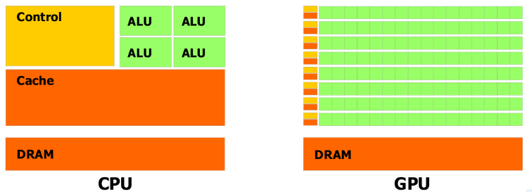

# Computer Architecture and Parallel Systems

## Computer Architecture

### Von Neumann Architecture

*Jon Von Neuman* introduced a notion of an universal
computer which complies with the following requirements: 
- Computer consists of memory, arithmetical-logical unit (**ALU**), control unit, input and output devices.
- All parts of a computer are connected together via **Bus**.
- Computer structure is independent on the computed problem, a computer is programmed with the content of the memory.
- Every computing step depends on the previous step.
- Machine instruction and data are in the same memory.
- Memory is split to small cells with the same size. Their ordinal numbers are called address numbers.
- Program consists of a sequence of instructions. Instructions are executed in order they are stored in memory.
- Sequence of instructions can be changed only by unconditional or conditional jump instructions. 
- Instructions, characters, data and numbers are represented in binary form.


With the advancements of computing, the Control Unit
and ALU are controlled today by the **CPU**.
- Memory and Devices are controlled by CPU.
- Bus between blocks integrate Data Bus, Address Bus and Control Bus.
- Data can pass through bus in half duplex mode to or from the CPU. 


Advantages: 
- Control Unit gets data and instructions in the same way from one memory which simplifies its design and development.
- Data from memory and from devices are accessed in the same way.
- Memory organization is in the hands of programmers.
- Computers with one bus are cheaper.
- Development of the Control Unit is cheaper and faster.

Disadvantages:
- Serial instruction processing does not allow a parallel execution of programs. Parallel executions are simulated later by the Operating system.
- One bus is a bottleneck.
- Instruction stored in the same memory as the data can be accidentally rewritten by an error in a program.

### Harvard Architecture

THe **MARK II** computer was finished at the Harvard University in 1947. It wasn't so modern as the computer from von Neumann's team. However, it introduced a slightly different architecture as memory for data was separated from the memory for instructions.


Advantages:
- Two memories with two Buses allow parallel access to data and instructions. Execution can be 2x faster.
- Both memories can be produced by different technologies (Flash/EEPROM, SRAM/DRAM).
- Both memories can use different cell sizes.
- Program can't rewrite itself.

Disadvantages;
- A Control unit for two Buses is more complicated and more expensive.
- Production of a computer with two Buses is more expensive.
- Development of a complicated Control Unit needs more time.
- Free data memory can't be used for instruction and vice-versa.

### Von Neuman vs Harvard

Harvard architecture is used primary for small embedded computers and signal processing (DSP). Von Neumann is better for desktop computers, laptops, workstations and high performance computers.

## Communication with devices

### Bus
According to von Neumann's architecture, all parts of computers are connected together via a bus. The Bus is a bundle of parallel wires separated to three main parts:
- **Data Bus** wires are marked as D0 ÷ DN, where N is the number of data bits (wires) used for transmission.
- **Addresses Bus** wires are marked A0 ÷ AM, where M is the number of bits used for addressing
- **Control Bus** is set of control signals to control activity on the bus:
    - **Reset** is a signal used to initialize all devices connected to the bus.
    - **RD/RW** control the direction of data transmission from/to devices.
    - **MEMR/MRMW** control data transfer from/to memory.
    - **Clock, Interrupt, DMA, Power Supply** and other as specified.


There is a 16 bit CPU with a 16 bit Address Bus and 8 bit Data Bus. 
The CPU uses 16 bits for addressing. It allows to address up to 64kB of memory. The chip of RAM with capacity 8kB and the chip of ROM with 8kB are connected to the bus:
- To address 8kB, it is necessary to use 13 bits, thus signals A0÷A12 are connected directly to RAM and ROM chip.
- The signal RD and WR (ROM is read only and thus WR is not connected) from the control bus are used to control the direction of communication.
- The Address decoder generates a signal CS (Chip Select – a signal for chip activation) for the RAM and ROM using the three highest bits A13÷A15. These 3 bits allow 8 combinations, which will be used depending on the desired computer design. For example bits 000 could activate *CSRAM* and 111 could activate *CSROM*. All other combinations can be ignored.
- Data from/to RAM and ROM are transferred by data bus D0÷D7.

### Multiplexer
In some computers, where low-cost is important, it is possible to reduce the number of wires in the bus. Some parts of the bus in this case are **multiplexed**. For instance, signals A0÷A7 could be shared with D0÷D7. In the first step the signals are sent to the Address Bus and in the second step the same wires are used to transfer data(Data Bus). Multiplexing reduces a computer's speed, but it makes it cheaper and easier. For many applications, where speed is not critical, the multiplexing is a good solution.

### Address Decoder
In the previous example we used the Address Decoder. Actually, the Address Decoder is a comparator of input value given by the signals AM÷AN and a stored value. When both values are the same, the Address Decoder activates the output pin. The Address Decoder can be connected to all signals on the Address Bus, or can use only selected signals. All chips connected to a Data Bus must satisfy the requirement that the pins on the chip connected to signals D0÷DN are in one of three states. When the chip reads data from the Data Bus, its pins must be in input mode. If a chip is writing data to the Data Bus, its pins must be in output mode. The third state is when a chip is not active, and all pins connected to the Data Bus are in an high impedance state not to disturb other chips on the bus.

### IO/Ports

The simplest way for communicating with devices is the usage of Input and Output Ports. The device connected to a bus has an integrated data register, called **Port**, where data is exchanged between CPU and the Device.

 

### IO/Ports method

When an executed program requires data from a device, it performs an instruction for reading from the bus. The Control Unit in the CPU generates a RD signal and the device writes data to the bus. Writing works in the same way, but with the WR signal and data is passed to the bus by the CPU and the device accepts it. The main disadvantage of this simple method is the nonexistence of feedback and thus data may be lost during the transfer.

### IO/Ports method with an Indicator

The feedback problem can be solved with an Indicator.
It is implemented by a RS Flip-flop. The output signal from this circuit is used to let the CPU know that the data is prepared.


When the Input Device has the data prepared, it uses the STB signal (Strobe) to set the Indicator. Its output is observed by the executed program. If the indicator is set, it is possible to read data safely. The Signal RD will clear the indicator during reading. It remains not set until new data is prepared for reading. This method will still have a problem with data loss. If the CPU delays reading from the device, it may fail or may overflow the internal register or buffer. This method is called spooling. It is not too effective, because it consumes too much of the CPU's performance.
The Indicator can be used for writing in similar way as for reading. The program in the CPU must check the Indicator before it writes data, to make sure, that the previous data was accepted. 

Instead of a STB signal we have an ACK signal(Acknowledge) used by Input Device.


### Using a Buffer with the Indicator

The sole usage of the Indicator is insufficient for time critical devices or devices with big data throughput. In this case, it is necessary to implement a Buffer (Queue) between the Device and the CPU. The Indicator is implemented as well.


The Buffer between the CPU and the Device allows to send a block of data in one step. It improves throughput from/to the device.


### Using Interrupt instead of an Indicator

Using the indicator for multiple devices is uncomfortable and overloads CPU through spooling. Thus CPU manufacturers introduced a better technology for communication with devices – called **interrupt**. It is an event generated by the device, which interrupts the execution of the main program, then the CPU calls the interrupt routine and when the device is handled, the CPU returns the execution back to the main program, being very effective. No useless testing of indicators in the loop are needed. This technology does not require construction changes for devices. Signal indicator is changed to IRQ (interrupt request) and it is not directly connected to the CPU, but to an interrupt controller. This circuit is able to serve more interrupt requests at the time, it masks selected requests, it evaluates priority in a different way and is able to communicate with the CPU and map interrupts to different interrupt routines.


### Slowness of IO/Ports

The communication with devices using I/O Ports has one big weakness. All data must be transported through the bus two times. When a program reads data from the device, the CPU has to read data from the device to the CPU – step R1 and then has to store it in memory – step R2. In the opposite direction, writing data to a device needs two steps too – W1 and W2.


### Direct Memory Access

To remove the main problem of I/O Ports – double data transfer - computer manufacturers have designed a new technology: DMA. 
All device controllers contain their own bus controller with three registers. The first one for the data transfer (I/O Port), the second one for the address and the third one is the counter.
The DMA controller controls data transmission from the device to memory directly without involving the CPU. This direct data transfer saves expensive CPU time, because the CPU can execute keep executing the program and is relieved of slave labor with the data. It also improves the bus bandwidth.
The DMA controller has to cooperate with the CPU, because only one bus controller can control the bus at any moment. The DMA controller and CPU use two signals – DMA Request and DMA Accept.


Before starting the DMA transfer, the CPU must set the Address Register and the Counter to the initial value. Then it starts the transfer for reading data from the device (or writing to the device):

1. The DMA controller sends DMA-Request to CPU.
2. When the CPU releases the bus, it sends a DMA-Accept to allow one DMA transfer.
3. The DMA sets a value from the address register to the Address Bus.
4. DMA writes data to the Data bus.
5. The Memory stores data from the bus to the given address on the address bus.
6. DMA increments the Address Register and decrements the Counter.
7. One byte is transferred.
8. If the counter is zero, the transmission ends, else the DMA continues from point 1.


The DMA is a very efficient technology for data transmission and is still used in today's computers. It saves the CPU time required for computing because it does not access the bus for a data transfer. This simple parallelism greatly improves overall system throughput and the computing performance.

### Finnaly Channels

In mainframes the DMA was replaced with a **Channel**. It is an higher level of the DMA. A Channel Controller has its own CPU to directly control the connected devices and this CPU only starts and stops communications.
The Channel operates similarly to the DMA but it allows to attach more devices.


Computer can implement more channels to communicate with enormous number of devices, without CPU overloading. 


## Risc Processors

The instruction set reduction is a well known feature of RISC processors. But developers had more goals in mind to improve the overall construction quality of the processor: 
- Only basic instructions are implemented. Complex instructions are substituted by sequence of instructions.
- All instructions have the same length – reading instructions from the memory is faster.
- All instructions use the same format – instruction decoding is easier and decoding units can be simple.
- Microprogramming controller is replaced by faster hardwired controller.
- Only two instructions can read/write data from/to memory – LOAD and STORE.
- Addressing modes are reduced to minimum number.
- More registers are implemented directly in processor.
- Pipelined execution of instructions is used.
- In every machine cycle one instruction is completed.
- Complex technical processor equipment is transferred to the programming language compiler. Programming in assembly language is not recommended.
All these features make up sophisticated and coherent circuit. When all instructions have the same length and format, then Fetch and Decode Units can have a simple design and can work faster. More registers had to be implemented, because not all instructions are able to access data directly in the memory and so, more temporary data is necessary to be stored in the processor.

### Pipelining

The Pipelining is the second well known property of the RISC processors.
The processor is a sequential circuit. It takes input command for processing and until it is done, it does not accept any new command.


The Input IN reads commands, the output OUT saves results and registers store the state of the circuit. The speed of execution is in the most cases given by external clock source. 

Because instructions are executed in more steps and these steps are processed in different parts of the circuit, experts tried to figure out, how to use all parts of the processor permanently. They changed from sequential circuit to chain of independent circuits.


Circuits S1 ÷ SN are separated stages of instruction execution. Blocks R1 ÷ RN are registers for temporary results passed between single steps. Input reads the instruction and output saves the result after processing. To consider the circuit as pipelined, all stages have to have the same duration, otherwise the slowest one hinders the process.

Now we can view instruction execution in five steps:

1. FE - Fetch instruction.
2. DE – Decoding instruction.
3. LD – Load data and operands.
4. EX – Instruction execution.
5. ST – Store result.

Machine instruction processing in the CISC processor:


On the diagram, you can see that the CISC processor is not able to start a new instruction execution, until previous instruction is finalized.

Machine instruction processing in the RISC processor:


Through the pipelining technique every part of the processor busy because different processor units are working with different parts of instructions processed in parallel.

From the previous two diagrams, it is visible that the CISC processor finished 2 instructions after 10 machine cycles, while the pipelined RISC has done 6 instruction in the same period.The question is: how many times does the pipelining increase the performance? Theoretically, in infinite time, the acceleration of execution is directly proportional to the length of the pipeline. In our case, the execution can be 5x faster. The common mistake is to think that the longer pipeline the faster the execution. That is not quite true. The jump instruction changes the address of the next executed instruction and therefore instructions in progress are lost. The Fetch unit has to start loading instructions from the new address.  From the beginning of this chapter we know, that normally code contains up to 14% of conditional jumps. A very long pipeline can cause great ineffectiveness, given by unnecessary losses of instructions in progress.

### Pipelining Queue Filling

The pipeline queue has to be filled by a continuous stream of instructions, as it was described earlier. Any delay will decrease the processor speed. The main problem is in the jumps instructions. The jump instruction to fixed addresses can be detected earlier in the first pipeline stages and this information may be quickly passed on to the Fetch Unit to start loading instructions from the new address. But the problem is with conditional jumps. The result, whether or not a jump will be done will be known only after the execution of the jump instruction during runtime. And this is the big weakness of pipelining. CPU manufacturers use different methods to decrease adverse effects of conditional jumps. Another problem with queue fulfillment arises when the program modifies itself. There are unprocessed instructions loaded in the processor. However, when it writes the instruction back to memory where it was already loaded, the old instruction is executed, not the new one. This problem is solved in modern processors in easy way: the program is not allowed to modify own code while running.

#### Pipelining Queue Filling - Delayed Jump

One simple method to manage conditional jumps, is a delayed jump. The processor starts loading instructions from the new address after all unfinished instructions are done.
E.g:

The processor uses a three level pipelining:
1. FD - Fetch and decode instruction.
2. EX - Execute instruction. 
3. ST - Store results.

Simple example C language program code snippet:

```c
    if(i++ == LIMIT) Res = 0;
    Res += x;
```

From the C language code the compiler will create the sequence of machine instructions:

```assembly
    I1: CMP i, LIMIT; compare
    I2: INC i; increment
    I3: JMPne label; jump if not equal
    I4: MOV Res, 0; move value to variable
        label:
    I5: ADD Res, x; addition
```


From the diagram it is visible that after the execution of the JMP instruction (it does not need to store result) the MOV instruction is in progress and the NEW instruction is fetched depending on the JMP result. But the MOV processing will continue regardless of the JMP result. And that is bad! The compiler must reorder the instruction sequence and put one useful instruction after JMP (if not possible, use NOP – no operation). 
In our example the compiler can swap instruction I2 and I3 and execution with delayed jump will be correct now:  


The INC instruction will be executed always as needed. Instruction NEW is loaded correctly depending on JMP result. It can be seen that JMP result is evaluated one machine instruction later, than in normal sequence. Thus we say: delayed jump.

#### Pipelining Queue Filling - Bit Branch Prediction

The second well-know method used for better queue fulfillment is bit(s) for jump prediction. The prediction can be divided into 2 groups:
- Static prediction – bits are part of the machine instruction and are set by a compiler or a programmer. They are set once and for all.
- Dynamic prediction – bits are in the processor and they are controlled dynamically during the code execution.
One bit static prediction is used in less powerful systems. It generates two failures in every loop – at the beginning and at the end. It does not matter for processors with short pipeline. 
In modern high performance systems two bits dynamic prediction is used. The processor monitors the behavior of the conditional jump instruction and changes prediction only after two failures in the sequence. Bits are implemented directly in the processor in the Branch Prediction Table part to maximize the performance.
The two bits prediction can be depicted by the state diagram:


State N predicts that jump will continue in normal sequence and state Y predicts jump to target address. From the diagram it is clear, that only two jumps in sequence – the Yes edges - can change the prediction from N to Y. And vice-versa.

#### Pipelining Queue Filling - Super-Scalar Architecture

Manufacturers use super-scalar architecture in the highest performance computers. We can say in a simplified way that the processor has two parallel pipelines. Usually only one pipeline is working. When a conditional jump is detected in the early stages of instruction processing, the first pipeline continues with the processing in the normal way – following instruction sequence. The second pipeline obtains signal from the first one to start execution at the conditional jump target address. But saving results is not allowed. When the result of the conditional jump is known, the super-scalar control unit in processor decides, which pipeline will continue. The first one can continue in the normal way without losses. When the second one is selected, instructions from target address are in progress and processing can continue without delay.The disadvantage of super-scalar architecture is the high price.

### Structural and Data Hazards

The pipeline filling is not the only problem of the RISC processors. In many cases a problem may occur, when some pipeline stage needs data, which are not yet available. For example, some instructions need the address of the operand, but the address may not yet have been stored by the previous instruction. If this happens, we call it a data hazard. The problem can be solved directly in the pipeline, or by a compiler that prepares the correct instruction sequence. 
Another type of the hazard occurs during handling the resources. When more pipeline stages need to load data from memory: e.g. the 1st fetches an instruction,the 2nd loads data and the 3rd stores the result. All stage circuits need access to the bus. But if the computer contains only one bus and it is impossible to use the bus in parallel, only one unit can use the bus at the same time. These types of hazards are called structural.


### Well Known RISC

Processors: ARM and MIPS

Microcomputers: Microchip, Atmel 

## Intel Processors Evolution

### Intel 8080 (1974)

This 8 bit processor is not directly the first member of x86 series, but it is one of the first commercially successful microprocessors. This microprocessor became the basis for a number of the first single-board computers and its instruction set inspired other manufacturers to develop 8-bit processors. It is compatible at the assembly level (not machine instructions) with its successor – a 16-bit version of the 8086. In 1977 it was replaced by a newer version of the 8085 and manufactured until the mid-eighties.

### Intel 8086 (1976)

This is the first 16-bit processor. It is able to address up to 1MB of memory using the 64kB block segmentation. This CPU is divided into two parts: an execution unit and a bus control unit. It contains eight 16-bit wide registers and four segment registers. This set of registers is the basis for all subsequent generations. The instruction queue is only 6 bytes long and after jump instruction it is erased and refilled.

### Intel 8088 (1975)

The year after the introduction of the 8086 processor,Intel presents a modification of the 8086 – the processor 8088. It was not a new type of processor because its all internal architecture remained unchanged, only the data bus width was reduced to 8-bit. The performance of that processor was decreased, because a 16-bit wide data had to be read in two bus cycles. But at the time there were many available peripheral chips for 8-bit microprocessors and they could be used for the Intel 8088 as well. Computers with the narrowed data bus are cheaper and simpler. Perhaps the best evidence of the suitability of this processor for the personal computer production, was the new standard PC-XT designed by IBM.

### Intel 80186/80188 (1982)

Intel introduces the new processor 80186. It implements improved architecture and many newly modified and accelerated instructions. The processor was primarily designed for embedded devices and it integrates many peripheral devices directly on the chip, especially DMA controller, clock, timers and ports. Thus it was incompatible with the PC-XT architecture. But some manufacturers used it in their personal computers.The success of this processor is evident by the fact that it was produced for 25 years and over these years it was gradually modernized. It was also licensed to many other manufacturers.

### Intel 80286 (1982)

Intel introduced the second x86 generation – the processor 80286. Higher performance was achieved by two enhancements: most instructions need less machine cycles for execution and the processor works on an higher frequency. The processor implements the new Protected Mode with possibility to address up to 16MB of RAM. For the backward compatibility the processor works in Real Mode. But programs written for R-M could not run in P-M. The processor uses in the P-M the MMU (Memory Management Unit) and it implements Virtual Memory in range 1GB. P-M and V-M allow programmers to develop new safe, multitasking and multiuse OS. These technologies were at that time usually used only in mainframe computers. IBM used this CPU for the new standard known as PC-AT. 


### Intel 80386DX (1985)

In 1985 Intel presented the first full 32-bit processor with the full backward compatibility in R-M. All registers were extended to 32-bit. The address and data bus are 32-bit wide. In P-M the processor was able to address 4GB memory for each process and up to 64TB of the whole virtual memory. This addressing mode has been used until today. The processor implemented a new Virtual Mode with compatibility with old R-M programs. Therefore old MS-DOS programs could be used in new operating systems. The processor had a cache memory controller for fast level 1 (L1) cache memory on the board. This memory was necessary for processors operating at a frequency over 30 MHz. Recommended size was 8:32kB. The first computer with 80386DX processor was introduced by Compaq.

### Intel 80386SX (1988)

Intel launched the 80386SX processor. It was a backward step because at that time the 80286 was very popular and there were many peripherals available on the market for the 16-bit bus. Intel modified the 80386DX for the 16-bit data bus and created the SX version. This processor allowed manufacturers to produce cheaper computers assembled from available chips.

#### FPU coprocessor 8087/287/387

The first three generations of Intel processors were produced without units for floating point numbers computing. These Floating Point Units, called coprocessors, were produced as separate circuits. The coprocessor had to cooperate with the main processor and its independent activity was not possible. Computer manufacturers had to implement a separated slot for coprocessor on the boards.

### Intel 80486DX (1989)

The forth generation of the Intel 80486DX processor brought a big step in processor development and was also the last pure CISC processor. The great increase of the number of transistors indicated a lot of modernizations. The processor was twice as powerful as the previous processor version running on the same frequency. Many improvements were done in the ALU, in the instruction queue and in throughput between internal parts. The processor contains a L1 cache with a size of 8kB shared for data and instructions. MMU unit was improved too, especially for an higher performance in protected mode. Another innovation was the FPU unit implementation directly on the chip. It did not improve the performance of the ALU, but the FPU unit implemented directly in the processor was much faster than a standalone unit on the board.

In 1991 Intel introduced a cheaper version of the 80486DX processor – the 80486SX version. This version did not implement the narrower data bus, as it was in the 80386SX version, but the 80486SX did not implement the FPU. In 1992 Intel introduced the 80486DX2 version. This version doubled the internal clock frequency and it was fully pin-compatible with the 80486DX. The first version was the DX2 50/25 MHz and 66/33 MHz followed. In 1994 the version 80486DX4 multiplied internal frequency three times (not expected 4x). Two versions 75/25 MHz and 100/33 MHz were supplied due to high frequency only by 3.3V and the processor lost pin-compatibility with the version 80486DX.

### Intel Pentium (1994)

It was the first x86 processor that implemented some RISC and superscalar features. The processor implemented two parallel ALU units. In ideal situations they could both work in parallel. When the processor executed some complex instruction both units had to cooperate. The branch prediction unit was implemented in the processor too. The processor contained separated L1 caches for data and code. The FPU was integrated there as well. The first processor version worked at 5V with frequency 60/66MHz and it was installed very seldom. The first commercially successful version came in 1995. It had a 3.3V supply and it worked with frequencies of 75/90/120MHz. In 1997 Intel added to the Pentium the multimedia unit MMX. 

### Intel Pentium Pro (1995)

The sixth Intel processor generation brought a major technological breakthrough. The processor development started together with Pentium, but at that time the goal was very challenging. The new RISC processor should be developed with the backward CISC instruction compatibility. The result was introduced in 1995 – the processor Pentium Pro. It was primarily designed for servers thanks to its higher performance,but with higher price. The advantage was also wider Address Bus – 36 bits. It allows to address up to 64GB physical memory.


The upper part of the scheme shows the first major change. The L2 cache memory is there implemented directly in the CPU. But the cache memory is made in a separate chip and it is connected directly to the processor chip in the package. It works on an external bus frequency. The Processor's Bus Interface Unit is directly connected to the L1 Caches, separated for code and data. The Fetch & Decode Unit reads old CISC x86 instructions from memory and decodes them to one or more RISC instructions, called micro-operations. All micro-ops have the same length – 118 bits. The Decode unit is very complex and is composed of more internal in parallel working units to decode CISC instructions fast enough. The decode unit is followed by the pure RISC processor.

Decoded instructions are not progressing into the instruction queue as one may expect. Instructions are stored in the Instruction Pool. It is a bank of 40 instructions. The Execution unit can select instructions from the pool in order to maximize the performance. This technology is called Out of order execution. The Execution unit is very complex and contains more in parallel working units: pair of ALUs and FPUs units. Executed instructions are put back to the pool with results. After that the Retire Unit stores results back to registers and to the L1 cache. Results continue through the bus interface unit to the L2 cache and to the main memory. The processor contains a Branch Prediction Unit and in the previous scheme is hidden in Fetch and Decode Unit. It can store up to 512 predictions. Prediction success rate is usually about 90%

### Pentium II (1997)

The Pentium II processor was introduced in 1997 and it directly succeeds Pentium Pro. Only the execution unit MMX was added. It was pretested in the Pentium processor. The L2 Cache is still in a separated chip in package. In 1998 Intel introduced the high-end version of Pentium II with 512kB of L2 cache and the cache was running on internal processor frequency. This processor was marked as Xeon. The Low-end processor with small or none L2 cache was marked as Celeron and it was used in cheap personal computers.

### Pentium III (1999)

The second successor of the Pentium Pro was introduced in 1999 and it had finally integrated the L2 cache on single chip together with the CPU core. The execution unit got another helper – the SSE unit and improved the branch prediction unit. The power management was significantly improved too. The PIII was the best processor for laptops for the next few years. The PIII processor was replaced by the next generation of the P4 processor, but later reappeared on the marked in upgraded form as Pentium M.

### Pentium 4 (2000)

This processor implements a new architecture NetBurst. It was to be the processor for the new multimedia world. But the first demonstration for experts was very unconvincing. The processor had the same performance as PIII on the same frequency, together with significantly higher current consumption.

### Itanium, Itanium 2 (2001)

Intel introduced Itanium in 2001 and it was supposed to be the 64-bit successor of the Pentium family. It was completely designed as the new pure RISC processor. Its main weakness was the poor backward compatibility with the 32-bit predecessors. It had implemented slow 32-bit decoding unit and users did not accept it.  The first version had the same performance in 32-bit mode as Pentium 100MHz. The second version was produced without that slow 32-bit simulator and the backward compatibility was solved by the software.

### Pentium M (2003)

The new Pentium M processor was introduced in 2003. It was designed primarily for notebooks. Intel took the best from the P3 architecture and used the latest experiences with bus communication and branch prediction from P4. Intel proposed this new processor with 1MB L2 cache on the chip. The result was surprisingly good. The Pentium M with 1.5GHz clock had nearly the same performance as P4 with 2.5GHz clock. And the power consumption was only 30% in comparison with P4! But this processor was strictly sold only for notebook as part of the Centrino technology. Intel still produced the P4 for desktops.

### Pentium 4 EM64T (2004)

In 2004 Intel introduced its first processor, where they had to accept third-party standard. AMD at that time had a successful 64-bit technology, which was created by extending the old 32-bit architecture. Because Intel did not want to lose market position, they had to adapt. All registers in the processor were extended to 64-bit, 8 new registers were added and address bus was extended to 40 bits. The new technology was marked as EM64T. The processor had very long pipeline (30 stages), it had to be clocked by high frequency and it was overheating. Power losses of the processor were in range from 85 to 115W!


### Intel Core, Core Duo, Core Solo (2006)

This processor was not only designed for notebooks. It had a 36-bit address bus and it was sold for desktops and servers too. The wider bus was not the only new feature. Intel started to implement two cores on the single chip. The power consumption was so improved that it was possible to use multiple cores even in battery-powered computers.The L2 cache implemented on the chip had capacity usually from 2 to 4MB.

### Intel Core 2

In 2006 the new 64-bit processor was introduced – Intel Core 2. It implements the EM64T technology and it was designed for all computer platforms – notebooks, desktops and servers. Manufactured variants differed only by the bus width, number of cores and L2 cache size. The introduction of this processor virtually stopped the development of NetBurst architecture.

### Intel Atom (2008)

In 2008 Intel presented the processor Atom. Only a few processors with the ultra low power consumption were available at that time on the market. These processors were produced by AMD – processors Geode, and by VIA – C7 and Eden. Intel at that time did not produce small processors and they needed to fill the gap on the market. Atom uses a completely new architecture named Bonnell.

## Computer Memories

### Memory Hierarchy

There are many types of memories used in today's computers. Memories are made using different technologies. There is a memory hierarchy according to their speed, capacity and price:
1. Registers – smallest and fastest SRAM memory in a processor.
2. Cache L1 – SRAM memory ranging from kB to tens of kB.
3. Cache L2 – SRAM memory ranging from tens of kB to tens of MB.
4. Main memory – DRAM size up to tens GB. 
5. Hard disks – magnetic memory, size up to a few 
6. Optical memory – CD, DVD, etc.
7. Magnetic tapes with capacity up to a few TB, but very slow. 

Registers are the fastest and the most expensive. Tapes are the slowest and the cheapest.

### Memory Classification

The internal computer memories are characterized by several parameters. Their first division is possible by memory access:
- RAM – Random Access Memory.
- SAM – Serial Access Memory.
- Special access – stack, queue, multi-ports, associative memory.

The second division of memories can be made according to the ability to read and/or to write:
- RWM – Read and Write memory.
- ROM – Read Only Memory.
- WOM – Write Only Memory.
- Combined Memory.

The third option is to divide memories by the type of memory cell:
- DRAM – Dynamic RAM, cell is capacitor.
- SRAM – Static RAM, cell is transistor flip-flop.
- EPROM, EEPROM, Flash – programmable memory, cell is a special MOS transistor. 

Memories are classified by all parameters simultaneously. For example the main operating memory of personal computers is usually (incorrectly) known as *RAM*. Correctly it should be marked as *RWM DRAM*.

### DRAM

The Dynamic RAM has all cells composed by a tiny capacitor with one transistor. All capacitors have their capacity in fF (femto Farad) and they are not able to store charge for a long time. They are very quickly losing their charge. Therefore the charge of all the capacitors in the chip has to be periodically refreshed every few milliseconds. The refresh was earlier made by reading the memory, e.g. by the DMA usage. Now the  refresh is implemented directly in the chip and does not need any external circuits. The transistor in all cells only passes charge from/to the capacitor. Every reading of a cell discharges the capacitor and therefore it has to be charged back.


The memory chip contains millions or billions of cells. Cells are organized in a square matrix and all cells have their own addresses, given by the address of a row and the address of a column. Therefore we have to specify two addresses to select a single cell: the row and the column. This two step addressing is a little slower than the direct addressing, but it needs less address signals. For example 1M of bits can be organized in a matrix of 1024x1024 (1k x 1k) and thus only 10(2^10 = 1024) address signals are needed. Normally for 1M of bits, 20 bits(10 for row and 10 for column, 10 + 10 = 20) would be necessary. One matrix forms one layer on the chip. The chip can integrate more layers and on the same address of the row and the column it has more bits stored. The scheme of 3D cells organization is on the next scheme. The chip contains 4M x 4 bits:


#### Writing to DRAM

At first it is necessary to send to the memory address of the ROW and then the address of the COL. Together with the COL address data is written to the data bus. Memory has now one bus clock cycle to accept data from the bus. And the cycle repeats.


#### Reading from DRAM

The processor sends to the bus the sequence of the ROW and COL address signals and the memory chip writes data to the bus in the next bus clock cycle and the processor takes them. The reading and writing from the memory in this way is not too fast and on average it takes tens of nanoseconds.


#### Reading from FP DRAM

When the processor reads data from the memory, then the next reading is in the most cases from the following addresses. Therefore a better version of DRAM was designed – the Fast Page DRAM. When the processor reads data from the following addresses, it is not necessary to send the ROW signal again. Only the following COL addresses are sent. Thus reading is faster. 


#### SDRAM

The processors are faster than memories. Therefore their manufacturers introduced a new version of memories to improve their performance – Synchronous DRAM. This memory obtains signals ROW and COL and then generates the following COL signals automatically inside the chip and sends data to the bus. No more control signals are needed. But the chip has to be synchronized with the processor clock signal.


#### DDR SDRAM

The latest generation of DRAM is DDR SDRAM technology – Double Data Rate SDRAM. This memory is two times faster than SDRAM. Data to the bus is sent two times per one clock cycle. This memory is even used in the computer as a double channel memory and the final average time of reading is in units of nanoseconds. The maximum transfer speed is up to a few gigabytes per second.


#### DRAM Modules

DRAM memories were produced over the time in several versions:
- DIP – Dual In-line Package. As well as many other semiconductor chips, the DRAM memory was produced in this usual package too. 
- SIPP – Single In-line Pin Packages. More DIP chips are mounted on a module - simple circuit board - with pins on one edge. But the insertion of a long line of pins in a connector was complicated. Pins usually bent and installations were unreliable. 
- SIMM – Single In-line Memory Module. The same as SIPP, but the connector is directly on the module edge without pins. First generation had 30 pins, second one 72 pins.
- DIMM – Dual In-line Memory Module. Designed for SDRAM, a DDR SDRAM and for 64 bits data bus. It is the successor of SIMM.
- SO-DIMM – Small Outline DIMM. It is designed for notebooks and embedded computers.

### Static Memory

The static memory has all cells designed as the RS flip-flop. The information in cells is kept until the state is changed. It does not need refresh. Therefore these memories are called static. One bit can be saved in a cell consisting of four or six transistors. In a cell implemented as four transistors version, two transistors work as flip-flops and use resistors as active load. Other two transistors are activated by the address wire and connect the cell to the data wire for the reading or writing. The more modern six transistors version of cells needs more transistors on the chip, but the resistor load is replaced by two transistors and the whole memory has lower power consumption. This design allows to design memories with greater capacity. 


The flip-flop memory cell design allows to read and to write data very fast. Thus static memory is used for the fastest memory in computers. But overall, the high number of transistors does not allow to produce chips with high capacity, as DRAM memory has. Because SRAM is used for memory with fast access, the internal structure is adapted accordingly. Memory cells are organized in the matrix, but all rows have their own full address. All cells in the row are activated in a single step. Therefore it is necessary to have a more complex decoder in the chip and use more address wires. However with lower memory capacity its price is significantly higher.

The next scheme shows the chip with 4 bits address bus and 16 rows. Each row contains 8 bits. 


### Nonvolatile Memory

The SRAM and DRAM memories hold information only when they are powered by the electricity. But in all computers it is necessary to store a lot of information permanently – BIOS, firmware, measured data, configuration, etc. – in nonvolatile memories. Nonvolatile memory needs power supply too, but only for data access. Information is held in special memory cells. They are constructed from the transistor with an insulated control electrode. Several types of these memories are used in computers:
- PROM or OTP – Programmable Read Only Memory, nowadays called One Time Programmable. This memory is used where stored information will never change. For example in microcomputer using that memory. 
- EPROM – Erasable PROM. This technology allows to clear the whole memory with ultraviolet light and program it again. But the chip has to be removed from board, which is inconvenient.
- EEPROM – Electrically Erasable PROM. This type of memory does not need UV light for erasing. It can be erased electrically. But for erasing it requires an higher voltage, like the normal power supply. Normally the chip is supplied by 5V and for erasing 12V is used. It is unpleasant too that the memory must always be erased completely.
- Flash – the successor of EEPROM. Flash memory is now used in most computers as a nonvolatile memory. It allows to erase only a small part of the memory and the modern version does not need an higher voltage for the erasing. It works with normal voltage 5V or 3.3V. The disadvantages remain slow erasure and limited number of writes. Flash memory is not used only for programs in computers. Now it is more and more used as computer “disk” due to decreasing price. It is known as SSD (Solid State Disk) or USB Flash Drive. 

### Memresistor

The fourth passive circuit component was already envisioned theoretically in 1971 but the first time it was made in 2008 by the Hewlett-Packard laboratories. The diagram with electrical properties:


The resistance of a memristor depends on the integral of the input applied to the terminals. Since the element "remembers" the amount of current that passed through it in the past, it was tagged with the name "memristor". Another way of describing a memristor is that it is any passive two-terminal circuit element that maintains a functional relationship between the time integral of current (called charge) and the time integral of voltage (often called flux, as it is related to magnetic flux). The slope of this function is called the memristance M. Memristor is nano device that remember information permanently, switch it in nanoseconds, it is super dense and power efficient. This makes memristors potential replacements for DRAM, Flash(nonvolatile), and disk. Probably in the near future, computers will use only one universal memory - “MRAM”. But redesign of computer architecture will be required.


## Monolithic Computers

The microcontroller, microcomputer, monolithic computer, single-chip computer, SOC – System on Chip, etc... are technical terms used to describe computers integrated in one package. As we already know, a computer consists of three inseparable parts: the processor, the memory and devices. Microcomputers are made for many low-end and middle complex applications for more than 30 years. There are tens of manufacturers of small computers, which produce a wide range of microcomputers. Thanks to continually falling prices and improving technology, microcomputers are practically used in all devices around us: in battery chargers, lights dimmers, in bike computers, remote-controllers, washing machines, dishwashers, food processors, vacuum cleaners, cars and many others...

### Architecture

All computers are designed according to the von Neumann or Harvard architecture. In most cases the second one is used for microcomputers. Microcomputers are usually controlled by a fixed program and they use data from their environment. The program is stored in the nonvolatile memory and data is stored in registers or the SRAM memory. Therefore, Harvard architecture is the natural choice. Older microcomputers were designed as CISC processors, but now all newest ones are designed as RISC. Programmers now prefer the C-language to the assembly language and so more complicated programming of RISC processors does not matter to anyone.

### Memories

As mentioned before, microcomputers contain two main memories. The first one is for the controlling program and the second one for data. The program is usually stored in some version of nonvolatile memory. In older microcomputers manufacturers implemented EPROM and the chip had a typical small window on the top for UV light erasing. Now, the Flash memories are used in most microprocessors and for the final applications the OTP memory can be used. RWM and Flash memories are used for data. While the program is running, it stores data in the RWM, but sometimes it is necessary to store some measurement, runtime data or corrections for the future usage in the Flash memory. The RWM memory can be usually divided into three layers, depending on frequency of data usage:

- Working registers – the first level of RWM. Generally,the microcomputer has one or two working registers, but it can have tens of them. The registers hold current (temporary) data. All instructions from the instruction set can (or must) use them. Instructions are usually hardwired to use specific register(s).  
- Universal scratchpad registers – here the program stores the most frequently used data. One part of  the instruction set is able to manipulate with these registers. But the format of instructions does not allow a wide address range. The limit is usually in the range from 16 to 256 registers. Some manufacturers solve this problem by creating register banks. The programmer can then switch between banks as required. In some processors, one selected bank of registers is used during the interrupt execution.
- RWM (or Flash) Memory – is used for larger or less-used data storage. The instruction set usually does not allow direct manipulation with the memory content, except instruction movement. This data has to be moved to working registers. Instructions of some processors allow to use data from this memory as the second operand. The result can not be stored directly back to this memory. In some microcomputers, the RWM memory is not implemented and we have to use some external memory.

Microcomputers can implement some other types of registers or memories: instruction pointer, flags, control registers, stack for storing return address, etc. Ports of devices are very often implemented in address space of  scratchpad registers or RWM.

### Synchronization

Processors are sequential circuits and they are controlled by the clock signal, including microcomputers. 
The synchronization is very important, because microcomputers are used to control technical applications, where time plays often an important role. Manufacturers have to describe very exactly the timing of all circuits inside the computer.


The previous scheme shows the clock signal with the period T0. Four clock periods are necessary for one machine cycle. Individual machine cycles are marked MCx. The scheme depicts the RISC processor PIC with 2 stages (FDx and EXx) and both stages require one machine cycle. Thus one instruction cycle (Ix) needs two machine cycles (MCx). The timing is primarily determined by the oscillator. Microcomputers are currently equipped with the ability to use more types of clock sources, with the internal oscillator. The microprocessor has usually reserved two pins marked as X1 and X2 for clock source.

Three common clock sources are:

- RC circuit – is the cheapest solution with higher inaccuracy. Since the timing depends on the value of the capacitor and resistor, it is not possible to have accurate timing. The value of both passive parts changes with temperature and moreover with capacitors age. 
- Crystal - is produced in wide range of frequencies and with very high accuracy. But its speed is fixed and it can not be changed. The disadvantage is to have other parts on the board: crystal plus two addition small capacitors. 
- External clock source – In many applications a clock source from other parts of circuit is used. It can also be produced by special oscillating circuits that can be adjusted during the operation. The dynamic decreasing of frequency can significantly reduce the microprocessor's power consumption, which is important for battery-powered applications. 

### RESET

The processor is a sequential circuit. The behavior of the processor does not depend only on machine instructions, but also on its internal states, which affects the results. Therefore it is very important to define an initial state of all circuits in the processor and computer. 
The reset is the initial state defined very exactly in a technical documentation for each processor and its peripherals. The correct reset state is achieved by the reset signal with a minimum prescribed period, because the reset is the sequence of consecutive activities in all computer circuits. Most of the registers are set to 0. Very important is the value in the instruction pointer. The first instruction of a program has to be on the given fixed address! The reset signal is usually external, but in some critical situations it can be generated internally by an auxiliary circuit.

### Protection against noise

Microcomputers are used in many applications where an environment for its operation is not always good. Therefore the noise protection of the microcomputer must be focused on multiple perspectives:
- Physical impacts – the microcomputer has to be able to work in wide range of temperature, air pressure, humidity, acceleration,...
- Mechanical resistance – the chip and its package has to be strong enough to allow physical impacts on the board.
- Electrical resistance – the chip has to be able to work in a wide range of voltage, because during the operation the voltage can significantly fluctuate. Microcomputers are today working normally in the range of voltage from 2.5 to 6V.
- Electromagnetic resistance - high currents in environment can cause the unwanted current induction. Therefore it is necessary to shield processors.

Not only the environment surrounding the computer is noisy. The main problem is very often in the program and the programmer. Because the program in the computer runs many hours or days, some registers in the computer or device can unexpectedly change their own states. Many times programmers make errors in the program and it does not work correctly. In both cases the result is an infinite loop. For this purpose the microcomputer has special independent circuit called WatchDog. If the program stops communicating with this circuit, the watchdog resets the microcomputer. The implementation is simple: the watchdog is a counter that is automatically and slowly decremented. When it comes to zero, it generates a reset signal. Therefore the program must only rarely rewrite value in the watchdog register to its maximum. Power supply is monitored in a similar way. When it drops below the allowed level, then the specific circuit stops the computer and resets it. This guard is BROWNOUT.

### Interrupt Subsystem

No computers can exist today without the interrupt support, including microcomputers. Interrupt allows effective responses to events from devices and it simplifies programming. The programmer should know some basic features of an interrupt subsystem. The first one is how to enable and disable interrupts. Then how to recognize, which device is the source of the interrupt and what must be done in the program within the interrupt. Usually a sequence of instructions is recommended. A programmer would also be interested in whether the interrupt can be nested and whether it is possible to set the interrupt priority. The possibility of nesting is dangerous, because it can cause looping. It is important to keep in mind that the main program can be interrupted at any time and anywhere. It is therefore important that the interrupt service always carries out only the necessary and then it quickly passes control back to the main program. 

### Devices

The computer is a processor, memory and - the third part – peripherals. Now we present several common peripherals.

#### Parallel Port

The first one, very important and the most widely used, is a Parallel Port (or Gate). Usually they are organized in 4 or 8 bit groups, accessed by registers. For every bit, there is one pin assigned on the microprocessor package. All ports can be set for the input or output (after reset a port is set to input mode for safety reasons). The internal wiring always significantly affects the electrical properties of the ports. Therefore manufacturers publish the wiring together with a table of electrical parameters. It is then easier to design the right electrical connection.


On the previous scheme a) is the open collector. It is very useful, because it allows the connection to the circuit with an higher voltage than the one with which the microcomputer is powered. The closed output transistor sets this output to an high-impedance state. 
The diagram b) shows the example of a bidirectional port. When the output transistor is closed, the output has a defined logical value. Programmers can read two values: the last written value to the D flip-flop or the real state on the output pin. The port implementation allows in some computers to manipulate all bits separately. In other computers the programmer has to use bitwise operations. 

Ports can be used for many purposes and they can simulate the behavior of other peripherals – serial ports, D/A converters, PWM, LCD controller, etc. But the simulation has to be done by the program and it decreases the available performance for the main application. 

#### Serial Communication

There are many types of serial interfaces. The parallel transfer on the bus is only used for short distances inside computers. 
The serial transfer needs only a few wires, it can be used for longer distances and it has a much easier controller. The disadvantage is the lower transfer speed. But today the newest semiconductor technology is able to use higher speeds. In computers and industrial technologies there are many standards for serial transmissions. They differ with speed, voltage,number of wires, one-way or bidirectional, connectors,how many devices are connected, etc...Standards used for serial communication on short distances are USB, (Universal Serial Bus), RS232 (12/5/3.3V), I2C (Inter-Integrated Circuit), 1-Wire, etc...Standards RS422, RS485, CAN Bus, Ethernet or other networking technology are used for communication on longer distances.


On the previous diagram there is the principle of serial communication. The processor puts data to the transmitter's data register (or buffer) and the controller in the serial interface passes it to the shift register. The data from this register is transmitted bit by bit to the shift register on receiver's side. When one transfer unit (byte, buffer, packet) is completed, then the receiver's controller passes the received data to the data register (or buffer). The serial transfer is usually performed in two basic modes:
1. Synchronous – one wire in serial line is used as clock signal.
2. Asynchronous – usually the first added bit synchronizes the independent clock sources in both serial interfaces. 

The communication with the clock signal is safer and easier. But it uses one extra wire and it is more expensive (especially for large distances). The asynchronous mode adds the synchronization data to the transmission, thus it decreases the transfer speed.


#### Timer, Counter

The timer is incremented by the internal processor clock signal. Whereas the counter counts changes depending on external signals.


Programmers set the initial value and turn the counting ON. When the value inside the counter overflows, an interrupt is automatically generated. Then programmers decide what will follow. The counter is very useful when we need to count some external events (wheel revolutions, button presses and the like).


The timer has more settings. Programmers can set a prescaler. It is a circuit in front of the counter to slow down the clock signal. The prescaler can be changed dynamically. In many microcomputers it is possible to select the clock source. The counter at the end of this chain works in the same way as the normal counter. The timer is used to generate periodic events – blinking LEDs, refresh display, check input signal, scan buttons state, etc... 


#### D/A Converters

Computer world is digital. The surrounding environment contains continuously changing physical quantities. That is why it is necessary to convert the analog value to digital ones - that computers understand and vice versa.
The easiest D/A converter is PWM – Pulse Wide Modulation. The principle is simple. The output signal from the microcomputer has two values: logical 0 - 0V and logical 1 – 5V. And how do we create the continuous signal from them? By switching the 0 and 1 in the unequal ratio of the time. For example, if we need 1V on the output, then the time period of 0 and 1 must be divided in the ratio of 4:1 (Duty Cycle). Average value is then 1V. To smooth the signal we have to connect the RC circuit. This circuit must satisfy one important condition:R·C ≫ T
But the RC circuit causes a small delay.


#### A/D COnverters

Many applications use in their own control system physical quantities from the environment. Measured values are in most cases represented by current, voltage or resistance. They are able to convert all values to voltage and then use an A/D converter. The result is then a number in digital form. The first simple and fast A/D converter is the Comparative converter. The measured voltage is divided by a series of resistors to many levels. Comparators are in all nodes between resistors. All comparators accept the same voltage. Two adjoining comparators detect required voltage on one resistor. The converter output value is a sequence number of that comparator. The comparative converter works very fast, because the voltage on resistors changes immediately, all comparators work in parallel and the result is generated directly without delay. But there is a problem with accuracy. The converter with 8 bits resolution requires 2^8 (256) comparators and it is not suitable for better resolution.


The comparative A/D converter is on the scheme above. The reference voltage is UREF and input voltage is UINP. KM comparators are implemented in circuit and the result is D0-DN bits (M=2^N).

#### A/D Converters with D/A Conversion


The principle of operation is based on the incremental approximation of the auxiliary D/A converter. Its output is compared with the input signal by a comparator. The output of the comparator indicates whether auxiliary voltage is greater or smaller than the input voltage. The incremental approximation is performed by a controller with a shift register. The 8 bit resolution requires to perform up to 256 comparisons. These converters are therefore suitable for measuring slowly changing physical quantities (temperature, humidity). But the converter can work much faster using a better approximation algorithm. Every programmer knows the algorithm for searching value in sorted array – binary search (half-interval search). This algorithm does not change value in the D/A register incrementally, but it starts looking it from the middle. When it is above or below, it moves by half of the interval in that direction. So only 8 steps are necessary for 8 bit resolution. 

### Integrating A/D Converters


The integrating A/D converters do not directly measure the voltage, but they measure the time of charging and discharging the capacitor. In the first step the capacitor is connected via the switch SW and resistor R to the input voltage UINP. The controller allows charging for a time period T1. Then the SW connects the capacitor to negative reference voltage - UREF and the controller measures the time of the discharging T2. We say that this is a "method of double integration". Because the product of time and voltage must be the same for both time periods, we can easily calculate the input voltage:UINP=UREF∗(T1/T2).
The input voltage can be very accurately computed from this formula. Therefore, these converters are used for more-bit (16-24) resolution.

#### A/D Converters with RC Cell


An analog quantity is in some applications represented by resistance. 
In these cases, we can construct an A/D converter with the RC circuit. It is necessary to have one pin with level voltage detection, e.g. Schmitt trigger circuit. The sensor RS and the reference resistance RREF are connected to two pins. Both resistances are connected to capacitor with capacity C. Now the program can connect the pin P1 to the voltage UC and charge the capacitor to this voltage. Then it is discharging the condenser until its voltage is UI and it measures the time TREF. The same process is made for pin P2 with the sensor. The result is then the time TS. We can calculate now the unknown sensor resistance RS from the following formula: RS=RREF∗(TS/TREF)

#### Other Devices

Microcomputers can be integrated many others devices:
- RTC – Real Time Clock circuit for real time. Usually is supplied by a separate battery. It can be synchronized by Long-wave signal.
- Charger controller for acid, NiCd, NiMH or Lion batteries. 
- Controller for LCD displays.
- Remote IR controller for TV and Audio.   
- On-screen menu for TV.
- Temperature sensors.
- Reference voltage source.
- Comparators.
- PWM generator.

## Hard Disks and Optical Drives

### Magnetic Medium

The principle applied to all magnetic disks is similar. There is a very thin magnetic surface on the carrier and information is saved as a magnetic orientation in small magnetic elements. The longitudinal write was used for fifty years. It is shown on the next scheme. Every drive uses two heads, one for reading and one for writing. 


Modern hard disks use greater density writing with – perpendicular write – see below. This principle required a change of the writing head design in a drive. The greater density provides more than the higher medium capacity. More information passes under the read head at the same time and it increases the speed of reading.


#### Giant Magnetic Resistance - GMR

Reading heads are using the technology invented in 1997 – Giant Magnetic Resistance. The resistance of the material depends on the ability to pass electrons. But very thin layers are also affected by quantum mechanics. Ferromagnetic material in magnetic fields can only pass electrons with the same spin.


On the previous picture there are two outside thin layers from ferromagnetic material (usually cobalt). The middle layer is a nonmagnetic metal (usually copper). When electrons come from the left side, the ferromagnetic material passes only those with a spin that has the same direction as the magnetic field. It can pass up to 50% of electrons. Now electrons pass through the middle layer to a second ferromagnetic layer. If the magnetic field in this layer has the same orientation as the first one, all electrons pass to the right side. Therefore all three layers have  low resistance .If the magnetic field has different orientation in both outside layers, no electrons are possible to pass through all layers and this structure has high resistance. The resistance is not measured directly in the hard disk read head. The voltage is connected to the head and the current passes through the GMR structure. When the resistance in the head grows, the current decreases. Thus we say that the head works as a "current valve".

#### Data Encoding

The first encoding system for digital data recording on magnetic media, was frequency modulation FM. This is a simple scheme, where a 1 is recorded as two consecutive flux reversals, and a 0 is recorded as a flux reversal followed by no flux reversal. The problem with FM is that it is wasteful. Each bit requires two flux reversal positions. FM was replaced by modified frequency modulation - MFM. The MFM reduces the number of flux reversals inserted just for the synchronization. Instead of inserting a synchronization reversal before each bit, one is inserted only between consecutive zeros.
An improvement of the MFM encoding is the Run Length Limited encoding (RLL). This is a more sophisticated coding technique. The RLL works by looking at groups of bits instead of encoding one bit at a time. The idea is to mix the synchronization and data flux reversals to allow even denser packing of encoded data to improve efficiency (up to 3 times).

### Hard Disks

Hard disks consist of several rounded plates with a magnetic surface. All plates are mounted parallel on the spindle (axis). The spindle is mounted in a bearing and rotation is provided by a synchronous (three phase) motor. The speed of rotation is usually in thousands of rotations per minute and it is constant. The second most important functional parts are (read and write) heads. There is one head moving above each plate surface. All heads are mounted on the a parallel with the spindle. This pivot does not rotate and the step motor tilts them in a small angle. Both functional parts are inserted in an aluminum alloy case from where the board with the driver and controller is mounted outside. The case has to be dust-proof. The hard disk is then connected to a computer board by a cable.


Plates rotate with at an high speed and heads move above the plates' surface. All heads move synchronously, because they are mounted firmly on the pivot. In each step an head makes a circle on a plate,called a track. Tracks with the same order number create virtual cylinders on plates.


Every track is divided to circle segments, which are in short called sectors. Tracks and sectors are on both sides of the plates.

#### Geometry

From the previously mentioned information we can conclude that the hard disk geometry is given in units: Cylinders – Heads – Sectors. The size of the sector is 512 bytes and the capacity of the disk can be computed as a product: Cylinder\*Heads\*Sectors*512. To write data on disk,  data is on a first step, written to all sectors in one track. Then the writing continues on the track with the same order number under the following head. When all heads finished writing to the single cylinder, then heads are moved to the next cylinder. The smallest addressing unit of the disk is one sector! When a program wants to read one byte, it must read the whole sector. Therefore a cache is installed on the disk controller, which speeds up the reading. Hard disk does not propagate outside its real CHS geometry. It presents some virtual geometry (LBA) and it internally converts the sector order number to internal geometry.

#### S.M.A.R.T

All hard disks are equipped with standardized technology: Self-Monitoring, Analysis and Reporting Technology, in short SMART. The purpose of SMART is to inform users about technical problems during running and warn them of impending failure. Early warning provides the user some time to back up data and replace the drive. Disk errors are predictable and unpredictable. Predictable errors cause more than 60% of failures and SMART can detect them in advance. The main monitored parameters, which may cause failure are e.g. distance between heads and plates - small distance may cause head crash. The number of bad sectors – the newest disks redirect bad sectors to a backup area. But when too many sectors are redirected, the disk is marked as unreliable. The high temperature - may damage some hard disk parts of hard disk. 
The time required for the disk to spin up – any changes of that time indicate imminent failure of the engine.

#### Parameters

All disks have a number of technical parameters. They are used by customers to make the proper selection:
- Capacity – GB/TB 
- Size of disk – external dimension
- Speed – RPM, usually thousands of rotations per minute. Higher speed can generate noise and the disk will warm up.
- Transfer speed – how many MB/s can the disk read or write.
- Interface – cable connector for one standard SATA, PATA, SAS.
- Access time – average delay before reading.
- Power consumption – disk with high consumption needs cooling. 
- MTBS – mean time between failures - value indicates the reliability of the disk. Disks designed for servers and RAIDs have significantly higher MTBF, than low-end disks for desktops. computers.

### Floppy Drives

Until recent past, floppy disks were in wide use. Now they have become quite rare. There were several types of floppy drives used in personal computers: 
- 5¼ with capacity of 360kB, 720kB (both sides) and 1.2MB
- 3½ with capacity of 720kB, 1.44MB and 2.88MB. - LS-120 – Superdisk with capacity of 120MB.
- ZIP – external or internal floppy drive with capacity 100MB.

Floppy disks were always manufactured in self-closing disk cartridges, apart from old 5¼ floppy disks. The floppy drive and the hard drive has one major technical difference, apart from the fact that floppy disks being removable media. The read head in the floppy drive has a direct contact with magnetic media. Floppy drive is therefore significantly slower,otherwise the media or the head could be damaged. Floppy disks have a low speed and also they have low reliability.


### Optical Drives


The laser diode emits a beam through a semi-transparent mirror to the first lens. A pre-focused laser beam continues through the second focusing lens to CD-ROM media. Pits or lands may/may not reflect the beam back. The bottom reflexive layer of the mirror directs the beam to the sensor – laser photo diode. This diode converts the reflected signal to a digital one and the device controller decodes them to data. The CD-ROM media has its data layer under the transparent polycarbonate surface and laser beam must pass it twice. On the opposite side there is data layer protected by a reflective layer, protective layer and paint.

#### Optical media

CD's and DVD's.
Capacity of DVD is greater not only due to higher density of information on DVD media. Changed encoding of stored data increases overall capacity of media nearly 7x.  

The CD-ROM has data stored in a spiral shape. This spiral represents totally up to 22188 turns with a total length up to 5.77 km. The DVD media stores data with an higher density so the total length is 11.84 km. The DVD media allows to store data in two layers on one side – capacity 8.5GB – and the DVD media can store data on both sides – total capacity of 4 layers is 17GB. A track on the optical media is divided to sectors of 2048 bytes (the disk has 512 bytes). Basic read speed of the CD-ROM was 150kB/s. This speed is marked as single speed. The drive speed is derived from this value. For DVD the basic speed is 1.38MB/s (nearly ten times faster than the CD-ROM). Maximum transfer speed given by manufacturer of optical drives can be achieved only on the outer edge of the media.

##### CD-ROM, CD-R, CD-RW


The CD-ROM drive has a content of data layer given by manufacturer. Data is pressed into an aluminum layer permanently.
The CD-R medium allows users to write their own data to the disk only once. The material of the recording layer allows to create pits by laser. But the laser must be ten times stronger for writing than for reading. The CD-R disc can store data for several years, the recording layer ages.
The CD-RW medium allows rewriting the data. The recording layer is from a special material. It is located between two dieletric layers. The recording layer can be melted by the laser and after the cooling it allows to write data in the same way as the CD-R medium. This process can be repeated many times. But each data write causes a little damage of recording layer. The problem is with the high speed of media rotation too. When the recording layer is melted, it is affected by centrifugal force. This force must not disrupt the recording layer!

##### DVD

The DVD disk has the same dimension as the CD-ROM disk. But the DVD disk can use both sides for data and therefore it is composed of two thinner (0.6 mm) polycarbonate disks. The data layer is between them. Disks are connected with glue. In addition, the drive allows two data layers on each side. Next pictures shows two cross-sections of the single side DVD disk with data in single (DVD-5) and two layers (DVD-9). The DVD drive uses two laser beams for two layered disk.


## Monitors

Monitors and displays are the most important interface between the user and the computer. They allow to display text and graphical information. Their properties are a major factor that determines the ergonomics of computer work (concurrently with sitting at the right and good quality chair).
The development of display units for computers, TV, PDA and cell phones has made a big progress in the last few decades. 
The following well known technologies have gained their important place on the market:
- CRT – Cathode Ray Tube
- LCD – Liquid Crystal Display
- Plasma display 
- OLED – Organic Light Emitting Diode
- E-Ink – Electronic (Electrophoretic) Ink.

### CRT

The CRT screen is the successor of the tubes. It is a glass vacuum tube. The front part of the screen is covered by luminophores. There is electron gun on the oposit side. Electron gun emits electrons and  a Wehnelt Cylinder guides them to the stream. In the focusing cylinder (g2-g5) the stream is narrowed to a thin ray. Because the Electron gun is the Cathode and the Screen is the Anode, the electron ray continues to screen. Then the ray has to pass through Focusing Coils, which direct the ray to specified point on the screen and it is able to control the ray intensity. When an electron ray reaches the luminophore on the screen, this material transforms the kinetic energy of electrons to photons. Thus the screen emits light. On the screen there are three types of luminophores – red, green, blue – to achieve a color, three electron guns work in the screen together, for each color individually.


The electron ray starts in the upper left of the screen corner and from left to right, line-by-line, quickly “draws” the image. Than the ray returns back from the bottom right corner to the upper left corner


The luminophore is able to emit light only for a few milliseconds and the image has to be redrawn many times per second. For human eyes the acceptable minimum refresh frequency is 60Hz. The ergonomic minimum is 72Hz and the best refresh rate is in the range from 80Hz to 100Hz. 
Regarding image quality, the shape of the screen mask is a very important topic. 
First RGB monitors used the Invar mask. It is a metal plate with small round holes arranged as a honeycomb. The main problem of this mask was the lower image quality on the screen edges. The latest monitors used Trinitron mask (designed and patented by Sony). The luminophor on the screen is organized in columns separated by thin wires. Screens with this technology can be flat have better image quality on the whole screen surface.

#### Pros and Cons

- Benefits: sharpness, color fidelity, good response, viewing angle, visible at daylight, working at all temperatures.
- Disadvantages: heavy, high power consumption, slow start, harmful radiation, aging of luminophores.

### LCD

The LCD technology – Liquid Crystal Display – is currently used in most monitors. As the name suggests,the main active components are liquid crystals. But the the LCD is assembled from multiple layers:


It can bee seen from the previous scheme that an LCD consists (minimally) of five layers. The source of light is on the LCD background. This light is polarized in all directions. The light has to be polarized by the first layer and continues through a transparent orientation plate to a nematic layer with crystals. Crystals in this layer have one very important property. They are able to change the orientation of the polarized light. The size of the change can be affected by the electrical voltage. The light with changed polarization passes through the second orientation layer to the outer polarization filter. This filter has an orthogonal polarization relative to the first filter. Thus, only light with changed polarization in the middle layer can pass through the last layer. Brightness (intensity) of the output light is controlled by the voltage in the middle layer in the nematic structures. The orientation filters help to set correct the orientation of crystals in this structure. Because crystals are in liquid state, their position change is delayed.


#### RGB LCD


When we need color representation, it is necessary to add the colored layer. You can see this on the previous picture. Light from the front polarized filter passes through one basic color filter – RGB – and because the source of light is white, the result is exactly one basic color. The resulting color is the combination of all three colors RGB. Thus all pixels on the color display consist of three smaller cells with different colors. The previous picture also shows, how LCD display controls the intensity of output light. We can get higher or lower light intensity by bigger or smaller rotation of light.

#### LCD Control

The control of all screen pixels is needed to draw the image on the LCD screen. As it was mentioned earlier, the brightness of pixel is controlled by the voltage in the middle layer. 
There are two known ways to control all pixels. 
The first one is passive display, where wires are integrated in both orientation layers. The bottom layer integrates an horizontal net of wires and the top layer the vertical net. The pixel on the screen is selected by proper horizontal and vertical wires and it is activated with a required voltage. But an interference between the wires may cause a blur. The whole image is then drawn in the same way as on CRT monitor. 
The second more sophisticated method to control LCD is active display with TFT. All cells in display have their own control transistor and pixel activation is faster and accurate.

#### Pros and Cons

- Benefits: low power consumption, light(weight), small dimensions, stable image. 
- Disadvantages: slow response, fixed resolution, color distortion, limited viewing angle, low brightness (on daylight), backlight.


### OLED

OLED – Organic LED display uses the newest semiconductor technology with organic materials. The scheme of one RGB pixel of a display is below. The organic emitter is inserted between two semiconductor layers.


The previous figure shows the OLED structure. The metal cathode is at the back of all layers. The second layer is semiconductor for electron transport. The next layer is an organic material capable of emitting light. The fourth layer is a transparent material for holes transport. Under the glass plate there are transparent anodes.When the power is connected to electrodes, electrons start to cumulate in the organic layer closer to the anode. Holes cumulate on the opposite site of an organic material. Holes and electrons start “to collide” in organic layer, electrons and holes eliminate each other and emit photons. This principle is called recombination.

#### AMOLED/PMOLED

The acronym AMOLED and PMOLED means Active / Passive Matrix OLED. This is the same principle as the active and passive LCD displays. Display pixels are organized into a rectangular matrix. Each OLED is activated in passive displays with two orthogonal electrodes. Electrodes pass through the entire width and height of the display. In AMOLED displays all OLEDs are activated by their own transistor.

#### Pros and Cons

- Benefits: high contrast, full range of color, low power consumption (directly proportional to required brightness), good viewing angle, without delay.


### E-Ink Display, Electronic Paper

E-book readers became nowadays very popular. They are based on an electronic paper, which uses the electronic ink – E-Ink. The scheme of one E-Ink cell is visible on the next picture


One cell is in E-Ink technology called capsule. All capsules have diameter in tens or hundreds of micrometers. Capsules contains electrophoretic (electrically separable) liquid. The liquid consists of the hydrocarbon oil, which is transparent and chemically stable for very long time. White particles with the positive charge swim in the oil. Black particles have the opposite charge. The oil is thick enough to keep particles in a stable position.White inorganic particles have the core made from the titanium oxide. The cover is silicon oxide and polymer. Black particles are made from the carbon. When the voltage is connected to electrodes, particles are attracted to the opposite charge. The top of black or white particles is then visible through the top transparent electrode. Particles stay in last position without current after voltage disconnection. The latest E-Ink technology uses divided electrodes and it is able to display 16 levels of the gray color.

#### Pros and Cons

- Benefits: high contrast, readable on direct sunlight, high resolution, wide view angle, does not need backlight, zero power consumption after image redraw. 
- Disadvantages: few levels of gray, no colors, slow redraw with long response.


## IC Technology

The first integrated circuits (IC) were produced just after the transistor had been invented. These circuits integrate all the necessary circuit components in one package. In computers, ICs are called Digital Circuits, because they work only with two signal levels. ICs can be divided according to the level of integration:
- IC – a few single transistors connected on a small board.
- SSI – Small scale integrity – up to 30 parts in a package.
- MSI – Medium SI – up to 1000 parts in a package.
- LSI – Large SI – up to 100000 parts in a package.
- VLSI – Very Large SI – up to 10 million parts in package.
- ULSI – Ultra Large SI – up to 1 billion parts in package.
- GSI – Gigantic SI – more than ULSI.

### Bipolar Technology

The bipolar technology uses bipolar transistors – NPN and PNP. This technology can achieve high speeds, but it has an high power consumption and it allows less integration. The first example is RTL. It uses only resistors and transistors to create two levels of signal (voltage). A simple inverter is shown on the scheme below. The input signal of this circuit is labeled A. An high level of this signal can open transistor T1. The opened transistor T1 connects the output A to the ground – the output is in low level. When the input signal is in low level, transistor T1 is closed and resistor RL directly passes the supply voltage to output A_dash, which is an high level. The output is inverted in both cases. This simple schema is very often used in various installations. 


### Diode TL

The second technology DTL was used earlier in digital circuit constructions. The technology uses diodes in addition to the transistors and resistors. A simple example of the NAND circuit is below. The transistor T1 together with the resistor RC works as the inverter. When A and B are disconnected or they are in log. 1, the voltage over the resistor R1 opens the transistor T1 and the output is in log. 0. When inputs A or B or both are connected to log. 0, the voltage between  D1 and D3 falls down and the transistor T1 is closed and output is in logical 1. The resistor R2 helps closing the transistor and diodes D3 and D4 increase noise immunity. The idea of the diodes on input pins is often used to extend some input pins of ICs.


### Transistor-Transistor Logic

It is used for simple and auxiliary circuits. The figure below shows an example of the NAND gate. The input is made from the multi-emitter transistor. It works in a similar way as diodes in DTL. The output is created from two transistors and it has better output parameters, especially the switching speed. Its output voltage in level 1 is not influenced by the size of the load. The transistor T2 accelerates the transition between output levels from 0 to 1 and back.


The TTL output part consists of two transistors, which allow a fundamental design feature: Three state output. This feature is absolutely necessary for digital circuits in computers. In this way , it is possible to connect more outputs together on the bus. You can see the scheme below. 


For many application another type of output is used – Open Collector. In the output part there is only a lower transistor and its collector is directly drained out. This output can be used to control the signal on buses (many signals are active in 0) or to switch to an higher voltage than one from the supply.


TTL digital circuits operate in precisely defined voltage levels. The high level signal – logical 1 is above 2.0V. The low level – logical 0 is under 0.8V. The forbidden area is between these both levels. When the signal changes its value, it has to pass through this area so quickly as it is possible. The narrowed zone around the forbidden zone – 0.4V - is the zone of the noise immunity


To speed up transistor switching the Schottky diode (metal-semiconductor) can be implemented in the circuit between a transistor base and a collector. The diode does not allow the full saturation of the transistor, and thus transistors can close faster.


### Unipolar Technology

Today the unipolar technology is one of the most important technologies used for IC production. This technology is used in all processors, chip-sets, peripherals, memories, etc...The elementary part of this technology is an unipolar transistor. It is better known under the acronym FET – Field Effected Transistor. The FET has three electrodes: S-Source (emitter),  D-Drain (collector) and G-Gate (base). We distinguish transistors according to their conductive channel – transistors with N-channel and P-channel. The FET controls the flow of electrons (or "holes") from the source to the drain by affecting the size and shape of a "conductive channel" created and influenced by the voltage (or lack of voltage) applied across the source terminal to the gate. This conductive channel is the "stream" through which electrons flow from source to drain. The transistor FET with a SiO2 insulation layer is known as MOSFET (Metal Oxide Semiconductor FET).


### MOSFET with N & P Channel

The cross section below is a FET with the P channel working in depletion mode. The principle of control is based on narrowing the conductive channel between S and D by voltage on the Gain.  


The cross section below is a FET with the N channel working in enhancement mode. The principle of the control is based on the creation and expansion of the conductive channel between S and D by the voltage on the Gain.


### PMOS

The PMOS technology is based on the MOSFET transistor with a P channel. The PMOS is the oldest technology used in digital circuits. The PMOS circuit has low power consumption thanks to FET transistors. But transistors with the P channel are slow and they use supply voltage of -10:-30V. The PMOS was also incompatible with TTL.

### NMOS, HMOS

The NMOS technology is based on the MOSFET with the N channel. Gates are implemented similarly to the PMOS technology. The transistor with the N channel is three times faster than the one with the P channel. NMOS circuits are easily compatible with TTL ones and they use supply voltage of +5V. 

The HMOS technology is based on the fact that the product of the delay and power dissipation is approximately proportional to the cube of the dimension of the basic structure. This means that while keeping the value of power dissipation constant,and reducing the structure size by 50%, achieving 8 times faster performance is possible. Or at the same speed it is possible to reduce the energy dissipation 8 times. The typical delay of the HMOS element is then about 1 ns. The next generation of the HMOS – HMOSII and HMOSIII were used for processors with a few hundred thousand transistors. HMOS gates have a delay in the range from 0.4 to 0.2 ns.


### CMOS

The CMOS (Complementary MOS) is a technology based on two technologies: the PMOS and NMOS. All gates in circuits are implemented by both technologies. The input signal is connected directly to the Gates of PMOS and NMOS transistors. When the Input is in logical 1, the PMOS transistor is closed and the NMOS is open. The output is connected to the ground and its level is in logical 0. And vice-versa. One transistor is always open and the second one is used as high resistance (load) in closed state. The current does not flow in both states from power supply to ground. Gates do not need current either. The consumption of gates is thus zero. This is the main advantage of CMOS! 
The CMOS technology is used in all computer parts today. Without this technology we could not achieve such a high performance computing we're used to. The CMOS technology is compatible with TTL and has a very good noise resistance.


### BiCMOS

The BiCMOS technology is a combination of the Bipolar and CMOS technology. The CMOS technology offers less power dissipation, higher packing density and smaller noise margins. The bipolar technology, on the other hand, ensures fast switching and high I/O speed and good noise immunity. The BiCMOS technology accomplishes both - improves the speed over CMOS and has lower`power dissipation than the bipolar technology. The main drawback of BiCMOS technology is the higher cost.

### FAMOS

The FAMOS (Floating–gate Avalanche–injection MOS) is used in the nonvolatile EPROM memory. The special transistor with the insulated gate is used as the single memory cell. The scheme of the transistor is below. The Gate is programmed by "electron injection". The higher voltage between C and E creates avalanche breakdown and charges the gate. The programming takes about 1 ms. The transistor is in a conductive state after programming. The charged gate can be "cleared" by the UV light. Every erasing process little by little destroys the control gate. The number of erasing and programming cycles is limited. Information will be safely stored in the memory for the next few decades.


### FLOTOX

The FLOTOX (FLOating–gate Tunnel OXide cell) is a nonvolatile memory semiconductor technology. It is the successor of the FAMOS and is used for EEPROM memories. The improvement of this technology is in the ability to clear contents of the memory electrically. No UV light is necessary. 
The cross section of the cell is shown below. The transistor uses two insulated gates. The upper gate is used to control the programming process, the Floating gate stores charge and creates the conductive channel. The charging and discharging of the floating gate is carried by the Tunnel between C and the Floating gate. The memory will safely store information for decades too. 


### FLASH Memory

The Flash memory removes one major disadvantage of the EEPROM and that is the higher voltage needed for the programming and erasing the memory. It also reduces the time required for programming the content of the memory and allows a much higher number of rewrites. The scheme of the transistor is very similar to the FLOTOX technology, it also uses two gates. But today's transistors are significantly smaller. Different materials are used too. One example of the flash memory technology is SONOS (Silicon-Oxide-Nitride-Oxide-Silicon). In 2005, the improvement of flash technology with the MLC (Multi-level cells) was introduced. The floating gate of the transistor is able to store four levels of the charge. Thus one transistor can store 2 bits. The cell with 2 levels of charge is called SLC - Single Level Cell. The MLC technology usually allows 100 thousand rewrites. But it is little slower than the SLC technology. The capacity of the flash memory of today is up to 4GB per single chip


#### NOR FLASH Memory

The flash memory is not only classified by the SLC and MLC technology. The internal structure of the chip is important too. The first example of its organization is the NOR flash. See below. In the NOR flash, each cell has one terminal connected directly to the ground, and the other one connected directly to a bit line. When one of the word lines (connected to the cell's CG) is brought to an high level, the corresponding storage transistor acts to pull the output bit line low. The NOR is suitable for embedded devices due to low latency.


#### NAND FLASH Memory

The NAND flash also uses floating-gate transistors, but they are connected in a way that resembles a NAND gate: several transistors are connected in series, and only if all word lines are pulled to high level, the bit line is pulled low. These groups are then connected via additional transistors to a NOR-style bit line array in the same way that single transistors are linked in a NOR flash. Despite the additional transistors, the reduction of ground wires and bit lines allows a denser layout and the greater storage capacity per chip. 


## CUDA

The General Purpose Graphics Processing Unit is one of the most modern  parallel  system  with  an  higher computing performance.  But there are more reasons why to become familiar with this technology:  - Massive parallelism (division of algorithms into elementary steps and its programming). 
- Correct data manipulation (transfer between GPU and CPU).
- Digital  image  handling  (processing)  and  graphical data representation in a computer.
- Representation of colors (RGB, BGR, RGBA, B&W)    - Representation of digital images data – matrices, linear sequence of bytes in memory.
- Introduction of Open Source Computer Vision Library (OpenCV). 
- Last but not least: Object programming

### Advantages of GPU Computing

GPUs are designed to run parallelly many hundreds of threads. They  can  virtually  execute  hundreds  of  thousands of threads. Therefore this architecture is called Massively Parallel System. 
All threads have to be independent. The GPU does not guarantee the order of thread execution. GPU is designed to process and compute intensive code with a limited number of conditional jumps.  
A better option is to write code without "if" conditions. A GPU does not support out of order execution (like Intel CPU) and is optimized for the sequential access to the main (global) memory of the graphical card. The transfer speed by the bus is up to hundreds of GB/s. Most of the transistors in a  GPU are designed for computing. Other auxiliary  circuits are minimized.

### GPU and CPU comparison



The scheme above shows the ratio of chip parts in a typical modern CPU and GPU. Green areas represent computing units. Yellow areas are controllers and orange ones are memories. The DRAM memory is neither part of the GPU or the CPU, but it has to be used to store data for computation.

### CUDA Architecture


CUDA  architecture  unified  the  internal  architecture of all Nvidia GPUs. The previous scheme shows that on the highest level there is a  graphical card divided to Multiprocessors.Every graphics card contains a different number of multiprocessors. The device memory is shared between all multiprocessors. It consists of three parts: the Global memory, Texture memory and Constants memory. All multiprocessors can share their data only using the device memory! The design of all microprocessors is the same. All of them contain shared memory for all processors in the single multiprocessor. All processors have their own bank of registers. Every multiprocessor has a cache to speed up the access to texture and constant memories. Both caches are read only. This unified architecture and terminology facilitates programming.

#### Fermi Architecture

In 2010 Nvidia introduced  its newest GPU architecture.
The newest GPU architecture is primarily designed for the general computing, not only for graphics cards. The scheme below shows only one multiprocessor. This multiprocessor contains 2x16 cores. Each core has one ALU and FPU unit. One group of 16 cores is called half-warp. One half-warp has one instruction decoder. All cores are implemented with 32 kB of registers and 64 kB shared memory and L1 data cache. Four SFU – Special Floating Point Unit are also available to handle transcendental and other special operations such as sin, cos, exp... Four  of  these  operations  can  be  issued  per  cycle  in  each multiprocessor. FPU Units can compute in single and double precision. ALU units support computation with 32 and 64 bits integers.


### Memories in a Computer

Up to now we have spoken only about GPU and  graphics card. These devices are installed in the computer  and it is necessary to familiar with memory organization in the computer. The Device is a graphical card with DRAM memory and GPU multiprocessors. The Host is any computer with an installed device. The memory in the device and the memory in the host are connected only by bus. They are not shared!


### Unified Memory

Unified  Memory  and  memory  sharing  are  driving  features of modernized GPU architectures. This  extends beyond system resources and reaches into L1/L2 Cache and texture cache with GPU.


### Computing Process

1. Copy data from the HOST memory to the DEVICE memory.
2. Start threads in the DEVICE.
3. Execute threads in GPUs multiprocessors.
4. Copy results back from the DEVICE memory to the HOST memory. 


The typical GPU computing process  is  shown  on  the  previous diagram. Before the GPU computing is started, it is necessary to move data from the computer main memory to the global device memory. Data is passed by the computer bus. This bus is much slower than memory buses in the computer and  graphics card. Today the graphics card uses usually the PCI-Express bus with transfer speed less than 5 GB/s. The second step is to transfer code to the GPU  and start the computing. The third phase is the  massively parallel execution of threads. During the  GPU computing the CPU can continue its own processes. The last step of computing is the transfer of the computed data from the device  memory back to the  computer main memory. Then the CPU in the computer can evaluate and use the results.


### GPU Computation Efficiency

It is important to keep in mind some basic rules to  maximize efficiency of GPU computing: 
- Minimize data transfer between host and the device. In an ideal case transfer data only twice. Before and after computing. 
- Use the GPU only for tasks with very intensive calculations. 
- GPU with shared memory on the board would be more suitable. 
- For intensive data transfer between CPU-GPU use pipelining. 
- GPU computing can be used alongside data transfer GPU-CPU or CPU computing. 
- Optimize access to shared memory. Sequential access is much faster then random  access.
- Reduce divergent threads. Select optimal thread grid.

### Programming

CUDA is not only a unified GPU architecture. 
CUDA is mainly a programming interface that allows  to use the GPU computing power. Today CUDA is  available for C/C++, Fortran, OpenCL, Direct  computing, Java and Python. 
Now we will shortly deal with the programming in C/C++. CUDA introduced a few language extensions to the standard. 
- The kernel is a function for GPU threads. The C/C++ is extended for kernel function execution using the command `name<<<...>>>(...)`.
- `__device__` is a function modifier. This function will be executed in the device and it can be called only from the device.
`__host__` is the opposite function modifier to `__device__`. Functions marked with this modifier are only for the CPU.
- `__global__` is a modifier for kernels. Functions will be executed in the GPU, but called from the CPU.

Variable type qualifier:
- `__device__` declares a variable that resides in the device as long as the application is running.
- `__constant__` is used for variables placed in constant memory.
- `__shared__`  variable resides in the shared memory  of the block, where the kernel is running. 

New types are defined for data shared between the GPU and CPU:
All common data types – `char`, `uchar`, `int`, `uint`, `short`, `ushort`, `long`, `ulong`, `float` and `double` are used as structures with suffix 1, 2,3 or 4. For example `int3` is a structure with 3  items. All members in the structures are accessible by the x,y, z and w fields. The grid dimension uses type `dim3 = uint3`.

```c++
int3 myvar;
myvar.x = myvar.y = myvar.z = 0;
```

All threads are organized in a grid and every thread in this grid has an exact position. Every thread has predefined variables to identify itself among others:
- `dim3 gridDim` contains the dimension of the whole grid.
- `uint3 blockIdx` contains the block position in the grid.
- `dim3 blockDim` contains the dimension of block (all blocks in the grid have the same dimension).
- `uint3 threadIdx` position of thread in a block.
- `int warpSize` contains the warp size in the threads.

### Grid


The grid organization is shown on the previous scheme. Programmers have to setup the grid before starting the kernel. The  kernel code has to be  adjusted to the proposed grid. When some thread  from the defined grid needs to know its own position,it has to use predefined variables to correctly identify which part of the problem will be computed just in this thread and kernel. 
The method of calculation was introduced in the previous diagram, where x and y are the exact positions in the grid (2D).


### API

CUDA API contains up to one hundred functions. Here are but a few for starters:
- `cudaDeviceReset()` - function to (re)initialize the device.
- `cudaDeviceSynchronize()` - synchronize the device and the host.
- `cudaGetLastError()` - returns `cudaSuccess` or an error code. 
-`CudaGetErrorsString(...)` returns a string for an error code.
- `CudaMalloc(...)` - allocates memory in the device.
- `CudaMallocManaged(...)` - allocates unified memory.
- `CudaFree(...)` - releases allocated memory.
- `CudaMemcpy(...)` - copies memory between the host and the device. The direction of copying is given  by the value of `cudaMemcpyHostToDevice` or `cudaMemcpyDeviceToHost`. 
- `printf()` - CUDA capabilities 2.0 or higher allow users to use printf. The output is not displayed in-line, but at the end of the computation.

```c++
// printf() is only supported
// for devices of compute capability 2.0 and above

__global__ void helloCUDA(float f)
    {
        printf("Hello thread %d, f=%f\n",threadIdx.x, f);
    }
void main(){
    helloCUDA<<<1, 5>>>(1.2345f);
    if ( cudaGetLastError() != cudaSuccess) {
        printf("Error: %s\n", cudaErrorString(cudaGetLastError()));
    }
    else 
        printf("Kernel finished successfuly\n");

    cudaDeviceSynchronize();
}
```