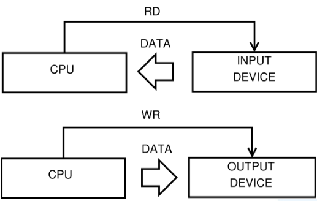

# Computer Architecture and Parallel Systems

## Computer Architecture

### Von Neumann Architecture

*Jon Von Neuman* introduced a notion of an universal
computer which complies with the following requirements: 
- Computer consists of memory, arithmetical-logical unit (**ALU**), control unit, input and output devices.
- All parts of a computer are connected together via **Bus**.
- Computer structure is independent on the computed problem, a computer is programmed with the content of the memory.
- Every computing step depends on the previous step.
- Machine instruction and data are in the same memory.
- Memory is split to small cells with the same size. Their ordinal numbers are called address numbers.
- Program consists of a sequence of instructions. Instructions are executed in order they are stored in memory.
- Sequence of instructions can be changed only by unconditional or conditional jump instructions. 
- Instructions, characters, data and numbers are represented in binary form.


With the advancements of computing, the Control Unit
and ALU are controlled today by the **CPU**.
- Memory and Devices are controlled by CPU.
- Bus between blocks integrate Data Bus, Address Bus and Control Bus.
- Data can pass through bus in half duplex mode to or from the CPU. 


Advantages: 
- Control Unit gets data and instructions in the same way from one memory which simplifies its design and development.
- Data from memory and from devices are accessed in the same way.
- Memory organization is in the hands of programmers.
- Computers with one bus are cheaper.
- Development of the Control Unit is cheaper and faster.

Disadvantages:
- Serial instruction processing does not allow a parallel execution of programs. Parallel executions are simulated later by the Operating system.
- One bus is a bottleneck.
- Instruction stored in the same memory as the data can be accidentally rewritten by an error in a program.

### Harvard Architecture

THe **MARK II** computer was finished at the Harvard University in 1947. It wasn't so modern as the computer from von Neumann's team. However, it introduced a slightly different architecture as memory for data was separated from the memory for instructions.


Advantages:
- Two memories with two Buses allow parallel access to data and instructions. Execution can be 2x faster.
- Both memories can be produced by different technologies (Flash/EEPROM, SRAM/DRAM).
- Both memories can use different cell sizes.
- Program can't rewrite itself.

Disadvantages;
- A Control unit for two Buses is more complicated and more expensive.
- Production of a computer with two Buses is more expensive.
- Development of a complicated Control Unit needs more time.
- Free data memory can't be used for instruction and vice-versa.

### Von Neuman vs Harvard

Harvard architecture is used primary for small embedded computers and signal processing (DSP). Von Neumann is better for desktop computers, laptops, workstations and high performance computers.

## Communication with devices

### Bus
According to von Neumann's architecture, all parts of computers are connected together via a bus. The Bus is a bundle of parallel wires separated to three main parts:
- **Data Bus** wires are marked as D0 ÷ DN, where N is the number of data bits (wires) used for transmission.
- **Addresses Bus** wires are marked A0 ÷ AM, where M is the number of bits used for addressing
- **Control Bus** is set of control signals to control activity on the bus:
    - **Reset** is a signal used to initialize all devices connected to the bus.
    - **RD/RW** control the direction of data transmission from/to devices.
    - **MEMR/MRMW** control data transfer from/to memory.
    - **Clock, Interrupt, DMA, Power Supply** and other as specified.


There is a 16 bit CPU with a 16 bit Address Bus and 8 bit Data Bus. 
The CPU uses 16 bits for addressing. It allows to address up to 64kB of memory. The chip of RAM with capacity 8kB and the chip of ROM with 8kB are connected to the bus:
- To address 8kB, it is necessary to use 13 bits, thus signals A0÷A12 are connected directly to RAM and ROM chip.
- The signal RD and WR (ROM is read only and thus WR is not connected) from the control bus are used to control the direction of communication.
- The Address decoder generates a signal CS (Chip Select – a signal for chip activation) for the RAM and ROM using the three highest bits A13÷A15. These 3 bits allow 8 combinations, which will be used depending on the desired computer design. For example bits 000 could activate *CSRAM* and 111 could activate *CSROM*. All other combinations can be ignored.
- Data from/to RAM and ROM are transferred by data bus D0÷D7.

### Multiplexer
In some computers, where low-cost is important, it is possible to reduce the number of wires in the bus. Some parts of the bus in this case are **multiplexed**. For instance, signals A0÷A7 could be shared with D0÷D7. In the first step the signals are sent to the Address Bus and in the second step the same wires are used to transfer data(Data Bus). Multiplexing reduces a computer's speed, but it makes it cheaper and easier. For many applications, where speed is not critical, the multiplexing is a good solution.

### Address Decoder
In the previous example we used the Address Decoder. Actually, the Address Decoder is a comparator of input value given by the signals AM÷AN and a stored value. When both values are the same, the Address Decoder activates the output pin. The Address Decoder can be connected to all signals on the Address Bus, or can use only selected signals. All chips connected to a Data Bus must satisfy the requirement that the pins on the chip connected to signals D0÷DN are in one of three states. When the chip reads data from the Data Bus, its pins must be in input mode. If a chip is writing data to the Data Bus, its pins must be in output mode. The third state is when a chip is not active, and all pins connected to the Data Bus are in an high impedance state not to disturb other chips on the bus.

### IO/Ports

The simplest way for communicating with devices is the usage of Input and Output Ports. The device connected to a bus has an integrated data register, called **Port**, where data is exchanged between CPU and the Device.

 

### IO/Ports method

When an executed program requires data from a device, it performs an instruction for reading from the bus. The Control Unit in the CPU generates a RD signal and the device writes data to the bus. Writing works in the same way, but with the WR signal and data is passed to the bus by the CPU and the device accepts it. The main disadvantage of this simple method is the nonexistence of feedback and thus data may be lost during the transfer.

### IO/Ports method with an Indicator

The feedback problem can be solved with an Indicator.
It is implemented by a RS Flip-flop. The output signal from this circuit is used to let the CPU know that the data is prepared.


When the Input Device has the data prepared, it uses the STB signal (Strobe) to set the Indicator. Its output is observed by the executed program. If the indicator is set, it is possible to read data safely. The Signal RD will clear the indicator during reading. It remains not set until new data is prepared for reading. This method will still have a problem with data loss. If the CPU delays reading from the device, it may fail or may overflow the internal register or buffer. This method is called spooling. It is not too effective, because it consumes too much of the CPU's performance.
The Indicator can be used for writing in similar way as for reading. The program in the CPU must check the Indicator before it writes data, to make sure, that the previous data was accepted. 

Instead of a STB signal we have an ACK signal(Acknowledge) used by Input Device.


### Using a Buffer with the Indicator

The sole usage of the Indicator is insufficient for time critical devices or devices with big data throughput. In this case, it is necessary to implement a Buffer (Queue) between the Device and the CPU. The Indicator is implemented as well.


The Buffer between the CPU and the Device allows to send a block of data in one step. It improves throughput from/to the device.


### Using Interrupt instead of an Indicator

Using the indicator for multiple devices is uncomfortable and overloads CPU through spooling. Thus CPU manufacturers introduced a better technology for communication with devices – called **interrupt**. It is an event generated by the device, which interrupts the execution of the main program, then the CPU calls the interrupt routine and when the device is handled, the CPU returns the execution back to the main program, being very effective. No useless testing of indicators in the loop are needed. This technology does not require construction changes for devices. Signal indicator is changed to IRQ (interrupt request) and it is not directly connected to the CPU, but to an interrupt controller. This circuit is able to serve more interrupt requests at the time, it masks selected requests, it evaluates priority in a different way and is able to communicate with the CPU and map interrupts to different interrupt routines.


### Slowness of IO/Ports

The communication with devices using I/O Ports has one big weakness. All data must be transported through the bus two times. When a program reads data from the device, the CPU has to read data from the device to the CPU – step R1 and then has to store it in memory – step R2. In the opposite direction, writing data to a device needs two steps too – W1 and W2.


### Direct Memory Access

To remove the main problem of I/O Ports – double data transfer - computer manufacturers have designed a new technology: DMA. 
All device controllers contain their own bus controller with three registers. The first one for the data transfer (I/O Port), the second one for the address and the third one is the counter.
The DMA controller controls data transmission from the device to memory directly without involving the CPU. This direct data transfer saves expensive CPU time, because the CPU can execute keep executing the program and is relieved of slave labor with the data. It also improves the bus bandwidth.
The DMA controller has to cooperate with the CPU, because only one bus controller can control the bus at any moment. The DMA controller and CPU use two signals – DMA Request and DMA Accept.


Before starting the DMA transfer, the CPU must set the Address Register and the Counter to the initial value. Then it starts the transfer for reading data from the device (or writing to the device):

1. The DMA controller sends DMA-Request to CPU.
2. When the CPU releases the bus, it sends a DMA-Accept to allow one DMA transfer.
3. The DMA sets a value from the address register to the Address Bus.
4. DMA writes data to the Data bus.
5. The Memory stores data from the bus to the given address on the address bus.
6. DMA increments the Address Register and decrements the Counter.
7. One byte is transferred.
8. If the counter is zero, the transmission ends, else the DMA continues from point 1.


The DMA is a very efficient technology for data transmission and is still used in today's computers. It saves the CPU time required for computing because it does not access the bus for a data transfer. This simple parallelism greatly improves overall system throughput and the computing performance.

### Finnaly Channels

In mainframes the DMA was replaced with a **Channel**. It is an higher level of the DMA. A Channel Controller has its own CPU to directly control the connected devices and this CPU only starts and stops communications.
The Channel operates similarly to the DMA but it allows to attach more devices.


Computer can implement more channels to communicate with enormous number of devices, without CPU overloading. 


## Risc Processors

The instruction set reduction is a well known feature of RISC processors. But developers had more goals in mind to improve the overall construction quality of the processor: 
- Only basic instructions are implemented. Complex instructions are substituted by sequence of instructions.
- All instructions have the same length – reading instructions from the memory is faster.
- All instructions use the same format – instruction decoding is easier and decoding units can be simple.
- Microprogramming controller is replaced by faster hardwired controller.
- Only two instructions can read/write data from/to memory – LOAD and STORE.
- Addressing modes are reduced to minimum number.
- More registers are implemented directly in processor.
- Pipelined execution of instructions is used.
- In every machine cycle one instruction is completed.
- Complex technical processor equipment is transferred to the programming language compiler. Programming in assembly language is not recommended.
All these features make up sophisticated and coherent circuit. When all instructions have the same length and format, then Fetch and Decode Units can have a simple design and can work faster. More registers had to be implemented, because not all instructions are able to access data directly in the memory and so, more temporary data is necessary to be stored in the processor.

### Pipelining

The Pipelining is the second well known property of the RISC processors.
The processor is a sequential circuit. It takes input command for processing and until it is done, it does not accept any new command.


The Input IN reads commands, the output OUT saves results and registers store the state of the circuit. The speed of execution is in the most cases given by external clock source. 

Because instructions are executed in more steps and these steps are processed in different parts of the circuit, experts tried to figure out, how to use all parts of the processor permanently. They changed from sequential circuit to chain of independent circuits.


Circuits S1 ÷ SN are separated stages of instruction execution. Blocks R1 ÷ RN are registers for temporary results passed between single steps. Input reads the instruction and output saves the result after processing. To consider the circuit as pipelined, all stages have to have the same duration, otherwise the slowest one hinders the process.

Now we can view instruction execution in five steps:

1. FE - Fetch instruction.
2. DE – Decoding instruction.
3. LD – Load data and operands.
4. EX – Instruction execution.
5. ST – Store result.

Machine instruction processing in the CISC processor:


On the diagram, you can see that the CISC processor is not able to start a new instruction execution, until previous instruction is finalized.

Machine instruction processing in the RISC processor:


Through the pipelining technique every part of the processor busy because different processor units are working with different parts of instructions processed in parallel.

From the previous two diagrams, it is visible that the CISC processor finished 2 instructions after 10 machine cycles, while the pipelined RISC has done 6 instruction in the same period.The question is: how many times does the pipelining increase the performance? Theoretically, in infinite time, the acceleration of execution is directly proportional to the length of the pipeline. In our case, the execution can be 5x faster. The common mistake is to think that the longer pipeline the faster the execution. That is not quite true. The jump instruction changes the address of the next executed instruction and therefore instructions in progress are lost. The Fetch unit has to start loading instructions from the new address.  From the beginning of this chapter we know, that normally code contains up to 14% of conditional jumps. A very long pipeline can cause great ineffectiveness, given by unnecessary losses of instructions in progress.

### Pipelining Queue Filling

The pipeline queue has to be filled by a continuous stream of instructions, as it was described earlier. Any delay will decrease the processor speed. The main problem is in the jumps instructions. The jump instruction to fixed addresses can be detected earlier in the first pipeline stages and this information may be quickly passed on to the Fetch Unit to start loading instructions from the new address. But the problem is with conditional jumps. The result, whether or not a jump will be done will be known only after the execution of the jump instruction during runtime. And this is the big weakness of pipelining. CPU manufacturers use different methods to decrease adverse effects of conditional jumps. Another problem with queue fulfillment arises when the program modifies itself. There are unprocessed instructions loaded in the processor. However, when it writes the instruction back to memory where it was already loaded, the old instruction is executed, not the new one. This problem is solved in modern processors in easy way: the program is not allowed to modify own code while running.

#### Pipelining Queue Filling - Delayed Jump

One simple method to manage conditional jumps, is a delayed jump. The processor starts loading instructions from the new address after all unfinished instructions are done.
E.g:

The processor uses a three level pipelining:
1. FD - Fetch and decode instruction.
2. EX - Execute instruction. 
3. ST - Store results.

Simple example C language program code snippet:

```c
    if(i++ == LIMIT) Res = 0;
    Res += x;
```

From the C language code the compiler will create the sequence of machine instructions:

```assembly
    I1: CMP i, LIMIT; compare
    I2: INC i; increment
    I3: JMPne label; jump if not equal
    I4: MOV Res, 0; move value to variable
        label:
    I5: ADD Res, x; addition
```


From the diagram it is visible that after the execution of the JMP instruction (it does not need to store result) the MOV instruction is in progress and the NEW instruction is fetched depending on the JMP result. But the MOV processing will continue regardless of the JMP result. And that is bad! The compiler must reorder the instruction sequence and put one useful instruction after JMP (if not possible, use NOP – no operation). 
In our example the compiler can swap instruction I2 and I3 and execution with delayed jump will be correct now:  


The INC instruction will be executed always as needed. Instruction NEW is loaded correctly depending on JMP result. It can be seen that JMP result is evaluated one machine instruction later, than in normal sequence. Thus we say: delayed jump.

#### Pipelining Queue Filling - Bit Branch Prediction

The second well-know method used for better queue fulfillment is bit(s) for jump prediction. The prediction can be divided into 2 groups:
- Static prediction – bits are part of the machine instruction and are set by a compiler or a programmer. They are set once and for all.
- Dynamic prediction – bits are in the processor and they are controlled dynamically during the code execution.
One bit static prediction is used in less powerful systems. It generates two failures in every loop – at the beginning and at the end. It does not matter for processors with short pipeline. 
In modern high performance systems two bits dynamic prediction is used. The processor monitors the behavior of the conditional jump instruction and changes prediction only after two failures in the sequence. Bits are implemented directly in the processor in the Branch Prediction Table part to maximize the performance.
The two bits prediction can be depicted by the state diagram:


State N predicts that jump will continue in normal sequence and state Y predicts jump to target address. From the diagram it is clear, that only two jumps in sequence – the Yes edges - can change the prediction from N to Y. And vice-versa.

#### Pipelining Queue Filling - Super-Scalar Architecture

Manufacturers use super-scalar architecture in the highest performance computers. We can say in a simplified way that the processor has two parallel pipelines. Usually only one pipeline is working. When a conditional jump is detected in the early stages of instruction processing, the first pipeline continues with the processing in the normal way – following instruction sequence. The second pipeline obtains signal from the first one to start execution at the conditional jump target address. But saving results is not allowed. When the result of the conditional jump is known, the super-scalar control unit in processor decides, which pipeline will continue. The first one can continue in the normal way without losses. When the second one is selected, instructions from target address are in progress and processing can continue without delay.The disadvantage of super-scalar architecture is the high price.

### Structural and Data Hazards

The pipeline filling is not the only problem of the RISC processors. In many cases a problem may occur, when some pipeline stage needs data, which are not yet available. For example, some instructions need the address of the operand, but the address may not yet have been stored by the previous instruction. If this happens, we call it a data hazard. The problem can be solved directly in the pipeline, or by a compiler that prepares the correct instruction sequence. 
Another type of the hazard occurs during handling the resources. When more pipeline stages need to load data from memory: e.g. the 1st fetches an instruction,the 2nd loads data and the 3rd stores the result. All stage circuits need access to the bus. But if the computer contains only one bus and it is impossible to use the bus in parallel, only one unit can use the bus at the same time. These types of hazards are called structural. 