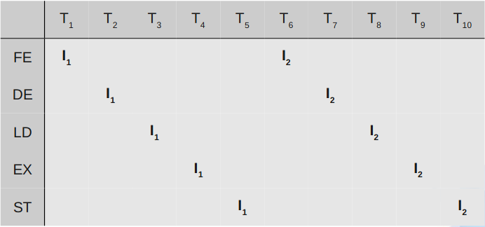

# Computer Architecture and Parallel Systems

## Computer Architecture

### Von Neumann Architecture

*Jon Von Neuman* introduced a notion of an universal
computer which complies with the following requirements: 
- Computer consists of memory, arithmetical-logical unit (**ALU**), control unit, input and output devices.
- All parts of a computer are connected together via **Bus**.
- Computer structure is independent on the computed problem, a computer is programmed with the content of the memory.
- Every computing step depends on the previous step.
- Machine instruction and data are in the same memory.
- Memory is split to small cells with the same size. Their ordinal numbers are called address numbers.
- Program consists of a sequence of instructions. Instructions are executed in order they are stored in memory.
- Sequence of instructions can be changed only by unconditional or conditional jump instructions. 
- Instructions, characters, data and numbers are represented in binary form.


With the advancements of computing, the Control Unit
and ALU are controlled today by the **CPU**.
- Memory and Devices are controlled by CPU.
- Bus between blocks integrate Data Bus, Address Bus and Control Bus.
- Data can pass through bus in half duplex mode to or from the CPU. 


Advantages: 
- Control Unit gets data and instructions in the same way from one memory which simplifies its design and development.
- Data from memory and from devices are accessed in the same way.
- Memory organization is in the hands of programmers.
- Computers with one bus are cheaper.
- Development of the Control Unit is cheaper and faster.

Disadvantages:
- Serial instruction processing does not allow a parallel execution of programs. Parallel executions are simulated later by the Operating system.
- One bus is a bottleneck.
- Instruction stored in the same memory as the data can be accidentally rewritten by an error in a program.

### Harvard Architecture

THe **MARK II** computer was finished at the Harvard University in 1947. It wasn't so modern as the computer from von Neumann's team. However, it introduced a slightly different architecture as memory for data was separated from the memory for instructions.


Advantages:
- Two memories with two Buses allow parallel access to data and instructions. Execution can be 2x faster.
- Both memories can be produced by different technologies (Flash/EEPROM, SRAM/DRAM).
- Both memories can use different cell sizes.
- Program can't rewrite itself.

Disadvantages;
- A Control unit for two Buses is more complicated and more expensive.
- Production of a computer with two Buses is more expensive.
- Development of a complicated Control Unit needs more time.
- Free data memory can't be used for instruction and vice-versa.

### Von Neuman vs Harvard

Harvard architecture is used primary for small embedded computers and signal processing (DSP). Von Neumann is better for desktop computers, laptops, workstations and high performance computers.

## Communication with devices

### Bus
According to von Neumann's architecture, all parts of computers are connected together via a bus. The Bus is a bundle of parallel wires separated to three main parts:
- **Data Bus** wires are marked as D0 ÷ DN, where N is the number of data bits (wires) used for transmission.
- **Addresses Bus** wires are marked A0 ÷ AM, where M is the number of bits used for addressing
- **Control Bus** is set of control signals to control activity on the bus:
    - **Reset** is a signal used to initialize all devices connected to the bus.
    - **RD/RW** control the direction of data transmission from/to devices.
    - **MEMR/MRMW** control data transfer from/to memory.
    - **Clock, Interrupt, DMA, Power Supply** and other as specified.


There is a 16 bit CPU with a 16 bit Address Bus and 8 bit Data Bus. 
The CPU uses 16 bits for addressing. It allows to address up to 64kB of memory. The chip of RAM with capacity 8kB and the chip of ROM with 8kB are connected to the bus:
- To address 8kB, it is necessary to use 13 bits, thus signals A0÷A12 are connected directly to RAM and ROM chip.
- The signal RD and WR (ROM is read only and thus WR is not connected) from the control bus are used to control the direction of communication.
- The Address decoder generates a signal CS (Chip Select – a signal for chip activation) for the RAM and ROM using the three highest bits A13÷A15. These 3 bits allow 8 combinations, which will be used depending on the desired computer design. For example bits 000 could activate *CSRAM* and 111 could activate *CSROM*. All other combinations can be ignored.
- Data from/to RAM and ROM are transferred by data bus D0÷D7.

### Multiplexer
In some computers, where low-cost is important, it is possible to reduce the number of wires in the bus. Some parts of the bus in this case are **multiplexed**. For instance, signals A0÷A7 could be shared with D0÷D7. In the first step the signals are sent to the Address Bus and in the second step the same wires are used to transfer data(Data Bus). Multiplexing reduces a computer's speed, but it makes it cheaper and easier. For many applications, where speed is not critical, the multiplexing is a good solution.

### Address Decoder
In the previous example we used the Address Decoder. Actually, the Address Decoder is a comparator of input value given by the signals AM÷AN and a stored value. When both values are the same, the Address Decoder activates the output pin. The Address Decoder can be connected to all signals on the Address Bus, or can use only selected signals. All chips connected to a Data Bus must satisfy the requirement that the pins on the chip connected to signals D0÷DN are in one of three states. When the chip reads data from the Data Bus, its pins must be in input mode. If a chip is writing data to the Data Bus, its pins must be in output mode. The third state is when a chip is not active, and all pins connected to the Data Bus are in an high impedance state not to disturb other chips on the bus.

### IO/Ports

The simplest way for communicating with devices is the usage of Input and Output Ports. The device connected to a bus has an integrated data register, called **Port**, where data is exchanged between CPU and the Device.

 

### IO/Ports method

When an executed program requires data from a device, it performs an instruction for reading from the bus. The Control Unit in the CPU generates a RD signal and the device writes data to the bus. Writing works in the same way, but with the WR signal and data is passed to the bus by the CPU and the device accepts it. The main disadvantage of this simple method is the nonexistence of feedback and thus data may be lost during the transfer.

### IO/Ports method with an Indicator

The feedback problem can be solved with an Indicator.
It is implemented by a RS Flip-flop. The output signal from this circuit is used to let the CPU know that the data is prepared.


When the Input Device has the data prepared, it uses the STB signal (Strobe) to set the Indicator. Its output is observed by the executed program. If the indicator is set, it is possible to read data safely. The Signal RD will clear the indicator during reading. It remains not set until new data is prepared for reading. This method will still have a problem with data loss. If the CPU delays reading from the device, it may fail or may overflow the internal register or buffer. This method is called spooling. It is not too effective, because it consumes too much of the CPU's performance.
The Indicator can be used for writing in similar way as for reading. The program in the CPU must check the Indicator before it writes data, to make sure, that the previous data was accepted. 

Instead of a STB signal we have an ACK signal(Acknowledge) used by Input Device.


### Using a Buffer with the Indicator

The sole usage of the Indicator is insufficient for time critical devices or devices with big data throughput. In this case, it is necessary to implement a Buffer (Queue) between the Device and the CPU. The Indicator is implemented as well.


The Buffer between the CPU and the Device allows to send a block of data in one step. It improves throughput from/to the device.


### Using Interrupt instead of an Indicator

Using the indicator for multiple devices is uncomfortable and overloads CPU through spooling. Thus CPU manufacturers introduced a better technology for communication with devices – called **interrupt**. It is an event generated by the device, which interrupts the execution of the main program, then the CPU calls the interrupt routine and when the device is handled, the CPU returns the execution back to the main program, being very effective. No useless testing of indicators in the loop are needed. This technology does not require construction changes for devices. Signal indicator is changed to IRQ (interrupt request) and it is not directly connected to the CPU, but to an interrupt controller. This circuit is able to serve more interrupt requests at the time, it masks selected requests, it evaluates priority in a different way and is able to communicate with the CPU and map interrupts to different interrupt routines.


### Slowness of IO/Ports

The communication with devices using I/O Ports has one big weakness. All data must be transported through the bus two times. When a program reads data from the device, the CPU has to read data from the device to the CPU – step R1 and then has to store it in memory – step R2. In the opposite direction, writing data to a device needs two steps too – W1 and W2.


### Direct Memory Access

To remove the main problem of I/O Ports – double data transfer - computer manufacturers have designed a new technology: DMA. 
All device controllers contain their own bus controller with three registers. The first one for the data transfer (I/O Port), the second one for the address and the third one is the counter.
The DMA controller controls data transmission from the device to memory directly without involving the CPU. This direct data transfer saves expensive CPU time, because the CPU can execute keep executing the program and is relieved of slave labor with the data. It also improves the bus bandwidth.
The DMA controller has to cooperate with the CPU, because only one bus controller can control the bus at any moment. The DMA controller and CPU use two signals – DMA Request and DMA Accept.


Before starting the DMA transfer, the CPU must set the Address Register and the Counter to the initial value. Then it starts the transfer for reading data from the device (or writing to the device):

1. The DMA controller sends DMA-Request to CPU.
2. When the CPU releases the bus, it sends a DMA-Accept to allow one DMA transfer.
3. The DMA sets a value from the address register to the Address Bus.
4. DMA writes data to the Data bus.
5. The Memory stores data from the bus to the given address on the address bus.
6. DMA increments the Address Register and decrements the Counter.
7. One byte is transferred.
8. If the counter is zero, the transmission ends, else the DMA continues from point 1.


The DMA is a very efficient technology for data transmission and is still used in today's computers. It saves the CPU time required for computing because it does not access the bus for a data transfer. This simple parallelism greatly improves overall system throughput and the computing performance.

### Finnaly Channels

In mainframes the DMA was replaced with a **Channel**. It is an higher level of the DMA. A Channel Controller has its own CPU to directly control the connected devices and this CPU only starts and stops communications.
The Channel operates similarly to the DMA but it allows to attach more devices.


Computer can implement more channels to communicate with enormous number of devices, without CPU overloading. 


## Risc Processors

The instruction set reduction is a well known feature of RISC processors. But developers had more goals in mind to improve the overall construction quality of the processor: 
- Only basic instructions are implemented. Complex instructions are substituted by sequence of instructions.
- All instructions have the same length – reading instructions from the memory is faster.
- All instructions use the same format – instruction decoding is easier and decoding units can be simple.
- Microprogramming controller is replaced by faster hardwired controller.
- Only two instructions can read/write data from/to memory – LOAD and STORE.
- Addressing modes are reduced to minimum number.
- More registers are implemented directly in processor.
- Pipelined execution of instructions is used.
- In every machine cycle one instruction is completed.
- Complex technical processor equipment is transferred to the programming language compiler. Programming in assembly language is not recommended.
All these features make up sophisticated and coherent circuit. When all instructions have the same length and format, then Fetch and Decode Units can have a simple design and can work faster. More registers had to be implemented, because not all instructions are able to access data directly in the memory and so, more temporary data is necessary to be stored in the processor.

### Pipelining

The Pipelining is the second well known property of the RISC processors.
The processor is a sequential circuit. It takes input command for processing and until it is done, it does not accept any new command.


The Input IN reads commands, the output OUT saves results and registers store the state of the circuit. The speed of execution is in the most cases given by external clock source. 

Because instructions are executed in more steps and these steps are processed in different parts of the circuit, experts tried to figure out, how to use all parts of the processor permanently. They changed from sequential circuit to chain of independent circuits.


Circuits S1 ÷ SN are separated stages of instruction execution. Blocks R1 ÷ RN are registers for temporary results passed between single steps. Input reads the instruction and output saves the result after processing. To consider the circuit as pipelined, all stages have to have the same duration, otherwise the slowest one hinders the process.

Now we can view instruction execution in five steps:

1. FE - Fetch instruction.
2. DE – Decoding instruction.
3. LD – Load data and operands.
4. EX – Instruction execution.
5. ST – Store result.

Machine instruction processing in the CISC processor:



On the diagram, you can see that the CISC processor is not able to start a new instruction execution, until previous instruction is finalized.

Machine instruction processing in the RISC processor:


Through the pipelining technique every part of the processor busy because different processor units are working with different parts of instructions processed in parallel.

From the previous two diagrams, it is visible that the CISC processor finished 2 instructions after 10 machine cycles, while the pipelined RISC has done 6 instruction in the same period.The question is: how many times does the pipelining increase the performance? Theoretically, in infinite time, the acceleration of execution is directly proportional to the length of the pipeline. In our case, the execution can be 5x faster. The common mistake is to think that the longer pipeline the faster the execution. That is not quite true. The jump instruction changes the address of the next executed instruction and therefore instructions in progress are lost. The Fetch unit has to start loading instructions from the new address.  From the beginning of this chapter we know, that normally code contains up to 14% of conditional jumps. A very long pipeline can cause great ineffectiveness, given by unnecessary losses of instructions in progress.

### Pipelining Queue Filling

The pipeline queue has to be filled by a continuous stream of instructions, as it was described earlier. Any delay will decrease the processor speed. The main problem is in the jumps instructions. The jump instruction to fixed addresses can be detected earlier in the first pipeline stages and this information may be quickly passed on to the Fetch Unit to start loading instructions from the new address. But the problem is with conditional jumps. The result, whether or not a jump will be done will be known only after the execution of the jump instruction during runtime. And this is the big weakness of pipelining. CPU manufacturers use different methods to decrease adverse effects of conditional jumps. Another problem with queue fulfillment arises when the program modifies itself. There are unprocessed instructions loaded in the processor. However, when it writes the instruction back to memory where it was already loaded, the old instruction is executed, not the new one. This problem is solved in modern processors in easy way: the program is not allowed to modify own code while running.

#### Pipelining Queue Filling - Delayed Jump

One simple method to manage conditional jumps, is a delayed jump. The processor starts loading instructions from the new address after all unfinished instructions are done.
E.g:

The processor uses a three level pipelining:
1. FD - Fetch and decode instruction.
2. EX - Execute instruction. 
3. ST - Store results.

Simple example C language program code snippet:

```c
    if(i++ == LIMIT) Res = 0;
    Res += x;
```

From the C language code the compiler will create the sequence of machine instructions:

```assembly
    I1: CMP i, LIMIT; compare
    I2: INC i; increment
    I3: JMPne label; jump if not equal
    I4: MOV Res, 0; move value to variable
        label:
    I5: ADD Res, x; addition
```


From the diagram it is visible that after the execution of the JMP instruction (it does not need to store result) the MOV instruction is in progress and the NEW instruction is fetched depending on the JMP result. But the MOV processing will continue regardless of the JMP result. And that is bad! The compiler must reorder the instruction sequence and put one useful instruction after JMP (if not possible, use NOP – no operation). 
In our example the compiler can swap instruction I2 and I3 and execution with delayed jump will be correct now:  


The INC instruction will be executed always as needed. Instruction NEW is loaded correctly depending on JMP result. It can be seen that JMP result is evaluated one machine instruction later, than in normal sequence. Thus we say: delayed jump.

#### Pipelining Queue Filling - Bit Branch Prediction

The second well-know method used for better queue fulfillment is bit(s) for jump prediction. The prediction can be divided into 2 groups:
- Static prediction – bits are part of the machine instruction and are set by a compiler or a programmer. They are set once and for all.
- Dynamic prediction – bits are in the processor and they are controlled dynamically during the code execution.
One bit static prediction is used in less powerful systems. It generates two failures in every loop – at the beginning and at the end. It does not matter for processors with short pipeline. 
In modern high performance systems two bits dynamic prediction is used. The processor monitors the behavior of the conditional jump instruction and changes prediction only after two failures in the sequence. Bits are implemented directly in the processor in the Branch Prediction Table part to maximize the performance.
The two bits prediction can be depicted by the state diagram:


State N predicts that jump will continue in normal sequence and state Y predicts jump to target address. From the diagram it is clear, that only two jumps in sequence – the Yes edges - can change the prediction from N to Y. And vice-versa.

#### Pipelining Queue Filling - Super-Scalar Architecture

Manufacturers use super-scalar architecture in the highest performance computers. We can say in a simplified way that the processor has two parallel pipelines. Usually only one pipeline is working. When a conditional jump is detected in the early stages of instruction processing, the first pipeline continues with the processing in the normal way – following instruction sequence. The second pipeline obtains signal from the first one to start execution at the conditional jump target address. But saving results is not allowed. When the result of the conditional jump is known, the super-scalar control unit in processor decides, which pipeline will continue. The first one can continue in the normal way without losses. When the second one is selected, instructions from target address are in progress and processing can continue without delay.The disadvantage of super-scalar architecture is the high price.

### Structural and Data Hazards

The pipeline filling is not the only problem of the RISC processors. In many cases a problem may occur, when some pipeline stage needs data, which are not yet available. For example, some instructions need the address of the operand, but the address may not yet have been stored by the previous instruction. If this happens, we call it a data hazard. The problem can be solved directly in the pipeline, or by a compiler that prepares the correct instruction sequence. 
Another type of the hazard occurs during handling the resources. When more pipeline stages need to load data from memory: e.g. the 1st fetches an instruction,the 2nd loads data and the 3rd stores the result. All stage circuits need access to the bus. But if the computer contains only one bus and it is impossible to use the bus in parallel, only one unit can use the bus at the same time. These types of hazards are called structural. 

## Intel Processors Evolution

### Intel 8080 (1974)

This 8 bit processor is not directly the first member of x86 series, but it is one of the first commercially successful microprocessors. This microprocessor became the basis for a number of the first single-board computers and its instruction set inspired other manufacturers to develop 8-bit processors. It is compatible at the assembly level (not machine instructions) with its successor – a 16-bit version of the 8086. In 1977 it was replaced by a newer version of the 8085 and manufactured until the mid-eighties.

### Intel 8086 (1976)

This is the first 16-bit processor. It is able to address up to 1MB of memory using the 64kB block segmentation. This CPU is divided into two parts: an execution unit and a bus control unit. It contains eight 16-bit wide registers and four segment registers. This set of registers is the basis for all subsequent generations. The instruction queue is only 6 bytes long and after jump instruction it is erased and refilled.

### Intel 8088 (1975)

The year after the introduction of the 8086 processor,Intel presents a modification of the 8086 – the processor 8088. It was not a new type of processor because its all internal architecture remained unchanged, only the data bus width was reduced to 8-bit. The performance of that processor was decreased, because a 16-bit wide data had to be read in two bus cycles. But at the time there were many available peripheral chips for 8-bit microprocessors and they could be used for the Intel 8088 as well. Computers with the narrowed data bus are cheaper and simpler. Perhaps the best evidence of the suitability of this processor for the personal computer production, was the new standard PC-XT designed by IBM.

### Intel 80186/80188 (1982)

Intel introduces the new processor 80186. It implements improved architecture and many newly modified and accelerated instructions. The processor was primarily designed for embedded devices and it integrates many peripheral devices directly on the chip, especially DMA controller, clock, timers and ports. Thus it was incompatible with the PC-XT architecture. But some manufacturers used it in their personal computers.The success of this processor is evident by the fact that it was produced for 25 years and over these years it was gradually modernized. It was also licensed to many other manufacturers.

### Intel 80286 (1982)

Intel introduced the second x86 generation – the processor 80286. Higher performance was achieved by two enhancements: most instructions need less machine cycles for execution and the processor works on an higher frequency. The processor implements the new Protected Mode with possibility to address up to 16MB of RAM. For the backward compatibility the processor works in Real Mode. But programs written for R-M could not run in P-M. The processor uses in the P-M the MMU (Memory Management Unit) and it implements Virtual Memory in range 1GB. P-M and V-M allow programmers to develop new safe, multitasking and multiuse OS. These technologies were at that time usually used only in mainframe computers. IBM used this CPU for the new standard known as PC-AT. 


### Intel 80386DX (1985)

In 1985 Intel presented the first full 32-bit processor with the full backward compatibility in R-M. All registers were extended to 32-bit. The address and data bus are 32-bit wide. In P-M the processor was able to address 4GB memory for each process and up to 64TB of the whole virtual memory. This addressing mode has been used until today. The processor implemented a new Virtual Mode with compatibility with old R-M programs. Therefore old MS-DOS programs could be used in new operating systems. The processor had a cache memory controller for fast level 1 (L1) cache memory on the board. This memory was necessary for processors operating at a frequency over 30 MHz. Recommended size was 8:32kB. The first computer with 80386DX processor was introduced by Compaq.

### Intel 80386SX (1988)

Intel launched the 80386SX processor. It was a backward step because at that time the 80286 was very popular and there were many peripherals available on the market for the 16-bit bus. Intel modified the 80386DX for the 16-bit data bus and created the SX version. This processor allowed manufacturers to produce cheaper computers assembled from available chips.

#### FPU coprocessor 8087/287/387

The first three generations of Intel processors were produced without units for floating point numbers computing. These Floating Point Units, called coprocessors, were produced as separate circuits. The coprocessor had to cooperate with the main processor and its independent activity was not possible. Computer manufacturers had to implement a separated slot for coprocessor on the boards.

### Intel 80486DX (1989)

The forth generation of the Intel 80486DX processor brought a big step in processor development and was also the last pure CISC processor. The great increase of the number of transistors indicated a lot of modernizations. The processor was twice as powerful as the previous processor version running on the same frequency. Many improvements were done in the ALU, in the instruction queue and in throughput between internal parts. The processor contains a L1 cache with a size of 8kB shared for data and instructions. MMU unit was improved too, especially for an higher performance in protected mode. Another innovation was the FPU unit implementation directly on the chip. It did not improve the performance of the ALU, but the FPU unit implemented directly in the processor was much faster than a standalone unit on the board.

In 1991 Intel introduced a cheaper version of the 80486DX processor – the 80486SX version. This version did not implement the narrower data bus, as it was in the 80386SX version, but the 80486SX did not implement the FPU. In 1992 Intel introduced the 80486DX2 version. This version doubled the internal clock frequency and it was fully pin-compatible with the 80486DX. The first version was the DX2 50/25 MHz and 66/33 MHz followed. In 1994 the version 80486DX4 multiplied internal frequency three times (not expected 4x). Two versions 75/25 MHz and 100/33 MHz were supplied due to high frequency only by 3.3V and the processor lost pin-compatibility with the version 80486DX.

### Intel Pentium (1994)

It was the first x86 processor that implemented some RISC and superscalar features. The processor implemented two parallel ALU units. In ideal situations they could both work in parallel. When the processor executed some complex instruction both units had to cooperate. The branch prediction unit was implemented in the processor too. The processor contained separated L1 caches for data and code. The FPU was integrated there as well. The first processor version worked at 5V with frequency 60/66MHz and it was installed very seldom. The first commercially successful version came in 1995. It had a 3.3V supply and it worked with frequencies of 75/90/120MHz. In 1997 Intel added to the Pentium the multimedia unit MMX. 

### Intel Pentium Pro (1995)

The sixth Intel processor generation brought a major technological breakthrough. The processor development started together with Pentium, but at that time the goal was very challenging. The new RISC processor should be developed with the backward CISC instruction compatibility. The result was introduced in 1995 – the processor Pentium Pro. It was primarily designed for servers thanks to its higher performance,but with higher price. The advantage was also wider Address Bus – 36 bits. It allows to address up to 64GB physical memory.


The upper part of the scheme shows the first major change. The L2 cache memory is there implemented directly in the CPU. But the cache memory is made in a separate chip and it is connected directly to the processor chip in the package. It works on an external bus frequency. The Processor's Bus Interface Unit is directly connected to the L1 Caches, separated for code and data. The Fetch & Decode Unit reads old CISC x86 instructions from memory and decodes them to one or more RISC instructions, called micro-operations. All micro-ops have the same length – 118 bits. The Decode unit is very complex and is composed of more internal in parallel working units to decode CISC instructions fast enough. The decode unit is followed by the pure RISC processor.

Decoded instructions are not progressing into the instruction queue as one may expect. Instructions are stored in the Instruction Pool. It is a bank of 40 instructions. The Execution unit can select instructions from the pool in order to maximize the performance. This technology is called Out of order execution. The Execution unit is very complex and contains more in parallel working units: pair of ALUs and FPUs units. Executed instructions are put back to the pool with results. After that the Retire Unit stores results back to registers and to the L1 cache. Results continue through the bus interface unit to the L2 cache and to the main memory. The processor contains a Branch Prediction Unit and in the previous scheme is hidden in Fetch and Decode Unit. It can store up to 512 predictions. Prediction success rate is usually about 90%

### Pentium II (1997)

The Pentium II processor was introduced in 1997 and it directly succeeds Pentium Pro. Only the execution unit MMX was added. It was pretested in the Pentium processor. The L2 Cache is still in a separated chip in package. In 1998 Intel introduced the high-end version of Pentium II with 512kB of L2 cache and the cache was running on internal processor frequency. This processor was marked as Xeon. The Low-end processor with small or none L2 cache was marked as Celeron and it was used in cheap personal computers.

### Pentium III (1999)

The second successor of the Pentium Pro was introduced in 1999 and it had finally integrated the L2 cache on single chip together with the CPU core. The execution unit got another helper – the SSE unit and improved the branch prediction unit. The power management was significantly improved too. The PIII was the best processor for laptops for the next few years. The PIII processor was replaced by the next generation of the P4 processor, but later reappeared on the marked in upgraded form as Pentium M.

### Pentium 4 (2000)

This processor implements a new architecture NetBurst. It was to be the processor for the new multimedia world. But the first demonstration for experts was very unconvincing. The processor had the same performance as PIII on the same frequency, together with significantly higher current consumption.

### Itanium, Itanium 2 (2001)

Intel introduced Itanium in 2001 and it was supposed to be the 64-bit successor of the Pentium family. It was completely designed as the new pure RISC processor. Its main weakness was the poor backward compatibility with the 32-bit predecessors. It had implemented slow 32-bit decoding unit and users did not accept it.  The first version had the same performance in 32-bit mode as Pentium 100MHz. The second version was produced without that slow 32-bit simulator and the backward compatibility was solved by the software.

### Pentium M (2003)

The new Pentium M processor was introduced in 2003. It was designed primarily for notebooks. Intel took the best from the P3 architecture and used the latest experiences with bus communication and branch prediction from P4. Intel proposed this new processor with 1MB L2 cache on the chip. The result was surprisingly good. The Pentium M with 1.5GHz clock had nearly the same performance as P4 with 2.5GHz clock. And the power consumption was only 30% in comparison with P4! But this processor was strictly sold only for notebook as part of the Centrino technology. Intel still produced the P4 for desktops.

### Pentium 4 EM64T (2004)

In 2004 Intel introduced its first processor, where they had to accept third-party standard. AMD at that time had a successful 64-bit technology, which was created by extending the old 32-bit architecture. Because Intel did not want to lose market position, they had to adapt. All registers in the processor were extended to 64-bit, 8 new registers were added and address bus was extended to 40 bits. The new technology was marked as EM64T. The processor had very long pipeline (30 stages), it had to be clocked by high frequency and it was overheating. Power losses of the processor were in range from 85 to 115W!


### Intel Core, Core Duo, Core Solo (2006)

This processor was not only designed for notebooks. It had a 36-bit address bus and it was sold for desktops and servers too. The wider bus was not the only new feature. Intel started to implement two cores on the single chip. The power consumption was so improved that it was possible to use multiple cores even in battery-powered computers.The L2 cache implemented on the chip had capacity usually from 2 to 4MB.

### Intel Core 2

In 2006 the new 64-bit processor was introduced – Intel Core 2. It implements the EM64T technology and it was designed for all computer platforms – notebooks, desktops and servers. Manufactured variants differed only by the bus width, number of cores and L2 cache size. The introduction of this processor virtually stopped the development of NetBurst architecture.

### Intel Atom (2008)

In 2008 Intel presented the processor Atom. Only a few processors with the ultra low power consumption were available at that time on the market. These processors were produced by AMD – processors Geode, and by VIA – C7 and Eden. Intel at that time did not produce small processors and they needed to fill the gap on the market. Atom uses a completely new architecture named Bonnell.

## Computer Memories

### Memory Hierarchy

There are many types of memories used in today's computers. Memories are made using different technologies. There is a memory hierarchy according to their speed, capacity and price:
1. Registers – smallest and fastest SRAM memory in a processor.
2. Cache L1 – SRAM memory ranging from kB to tens of kB.
3. Cache L2 – SRAM memory ranging from tens of kB to tens of MB.
4. Main memory – DRAM size up to tens GB. 
5. Hard disks – magnetic memory, size up to a few 
6. Optical memory – CD, DVD, etc.
7. Magnetic tapes with capacity up to a few TB, but very slow. 

Registers are the fastest and the most expensive. Tapes are the slowest and the cheapest.

### Memory Classification

The internal computer memories are characterized by several parameters. Their first division is possible by memory access:
- RAM – Random Access Memory.
- SAM – Serial Access Memory.
- Special access – stack, queue, multi-ports, associative memory.

The second division of memories can be made according to the ability to read and/or to write:
- RWM – Read and Write memory.
- ROM – Read Only Memory.
- WOM – Write Only Memory.
- Combined Memory.

The third option is to divide memories by the type of memory cell:
- DRAM – Dynamic RAM, cell is capacitor.
- SRAM – Static RAM, cell is transistor flip-flop.
- EPROM, EEPROM, Flash – programmable memory, cell is a special MOS transistor. 

Memories are classified by all parameters simultaneously. For example the main operating memory of personal computers is usually (incorrectly) known as *RAM*. Correctly it should be marked as *RWM DRAM*.

### DRAM

The Dynamic RAM has all cells composed by a tiny capacitor with one transistor. All capacitors have their capacity in fF (femto Farad) and they are not able to store charge for a long time. They are very quickly losing their charge. Therefore the charge of all the capacitors in the chip has to be periodically refreshed every few milliseconds. The refresh was earlier made by reading the memory, e.g. by the DMA usage. Now the  refresh is implemented directly in the chip and does not need any external circuits. The transistor in all cells only passes charge from/to the capacitor. Every reading of a cell discharges the capacitor and therefore it has to be charged back.


The memory chip contains millions or billions of cells. Cells are organized in a square matrix and all cells have their own addresses, given by the address of a row and the address of a column. Therefore we have to specify two addresses to select a single cell: the row and the column. This two step addressing is a little slower than the direct addressing, but it needs less address signals. For example 1M of bits can be organized in a matrix of 1024x1024 (1k x 1k) and thus only 10(2^10 = 1024) address signals are needed. Normally for 1M of bits, 20 bits(10 for row and 10 for column, 10 + 10 = 20) would be necessary. One matrix forms one layer on the chip. The chip can integrate more layers and on the same address of the row and the column it has more bits stored. The scheme of 3D cells organization is on the next scheme. The chip contains 4M x 4 bits:


#### Writing to DRAM

At first it is necessary to send to the memory address of the ROW and then the address of the COL. Together with the COL address data is written to the data bus. Memory has now one bus clock cycle to accept data from the bus. And the cycle repeats.


#### Reading from DRAM

The processor sends to the bus the sequence of the ROW and COL address signals and the memory chip writes data to the bus in the next bus clock cycle and the processor takes them. The reading and writing from the memory in this way is not too fast and on average it takes tens of nanoseconds.


#### Reading from FP DRAM

When the processor reads data from the memory, then the next reading is in the most cases from the following addresses. Therefore a better version of DRAM was designed – the Fast Page DRAM. When the processor reads data from the following addresses, it is not necessary to send the ROW signal again. Only the following COL addresses are sent. Thus reading is faster. 


#### SDRAM

The processors are faster than memories. Therefore their manufacturers introduced a new version of memories to improve their performance – Synchronous DRAM. This memory obtains signals ROW and COL and then generates the following COL signals automatically inside the chip and sends data to the bus. No more control signals are needed. But the chip has to be synchronized with the processor clock signal.


#### DDR SDRAM

The latest generation of DRAM is DDR SDRAM technology – Double Data Rate SDRAM. This memory is two times faster than SDRAM. Data to the bus is sent two times per one clock cycle. This memory is even used in the computer as a double channel memory and the final average time of reading is in units of nanoseconds. The maximum transfer speed is up to a few gigabytes per second.


#### DRAM Modules

DRAM memories were produced over the time in several versions:
- DIP – Dual In-line Package. As well as many other semiconductor chips, the DRAM memory was produced in this usual package too. 
- SIPP – Single In-line Pin Packages. More DIP chips are mounted on a module - simple circuit board - with pins on one edge. But the insertion of a long line of pins in a connector was complicated. Pins usually bent and installations were unreliable. 
- SIMM – Single In-line Memory Module. The same as SIPP, but the connector is directly on the module edge without pins. First generation had 30 pins, second one 72 pins.
- DIMM – Dual In-line Memory Module. Designed for SDRAM, a DDR SDRAM and for 64 bits data bus. It is the successor of SIMM.
- SO-DIMM – Small Outline DIMM. It is designed for notebooks and embedded computers.

### Static Memory

The static memory has all cells designed as the RS flip-flop. The information in cells is kept until the state is changed. It does not need refresh. Therefore these memories are called static. One bit can be saved in a cell consisting of four or six transistors. In a cell implemented as four transistors version, two transistors work as flip-flops and use resistors as active load. Other two transistors are activated by the address wire and connect the cell to the data wire for the reading or writing. The more modern six transistors version of cells needs more transistors on the chip, but the resistor load is replaced by two transistors and the whole memory has lower power consumption. This design allows to design memories with greater capacity. 


The flip-flop memory cell design allows to read and to write data very fast. Thus static memory is used for the fastest memory in computers. But overall, the high number of transistors does not allow to produce chips with high capacity, as DRAM memory has. Because SRAM is used for memory with fast access, the internal structure is adapted accordingly. Memory cells are organized in the matrix, but all rows have their own full address. All cells in the row are activated in a single step. Therefore it is necessary to have a more complex decoder in the chip and use more address wires. However with lower memory capacity its price is significantly higher.

The next scheme shows the chip with 4 bits address bus and 16 rows. Each row contains 8 bits. 


### Nonvolatile Memory

The SRAM and DRAM memories hold information only when they are powered by the electricity. But in all computers it is necessary to store a lot of information permanently – BIOS, firmware, measured data, configuration, etc. – in nonvolatile memories. Nonvolatile memory needs power supply too, but only for data access. Information is held in special memory cells. They are constructed from the transistor with an insulated control electrode. Several types of these memories are used in computers:
- PROM or OTP – Programmable Read Only Memory, nowadays called One Time Programmable. This memory is used where stored information will never change. For example in microcomputer using that memory. 
- EPROM – Erasable PROM. This technology allows to clear the whole memory with ultraviolet light and program it again. But the chip has to be removed from board, which is inconvenient.
- EEPROM – Electrically Erasable PROM. This type of memory does not need UV light for erasing. It can be erased electrically. But for erasing it requires an higher voltage, like the normal power supply. Normally the chip is supplied by 5V and for erasing 12V is used. It is unpleasant too that the memory must always be erased completely.
- Flash – the successor of EEPROM. Flash memory is now used in most computers as a nonvolatile memory. It allows to erase only a small part of the memory and the modern version does not need an higher voltage for the erasing. It works with normal voltage 5V or 3.3V. The disadvantages remain slow erasure and limited number of writes. Flash memory is not used only for programs in computers. Now it is more and more used as computer “disk” due to decreasing price. It is known as SSD (Solid State Disk) or USB Flash Drive. 

### Memresistor

The fourth passive circuit component was already envisioned theoretically in 1971 but the first time it was made in 2008 by the Hewlett-Packard laboratories. The diagram with electrical properties:


The resistance of a memristor depends on the integral of the input applied to the terminals. Since the element "remembers" the amount of current that passed through it in the past, it was tagged with the name "memristor". Another way of describing a memristor is that it is any passive two-terminal circuit element that maintains a functional relationship between the time integral of current (called charge) and the time integral of voltage (often called flux, as it is related to magnetic flux). The slope of this function is called the memristance M. Memristor is nano device that remember information permanently, switch it in nanoseconds, it is super dense and power efficient. This makes memristors potential replacements for DRAM, Flash(nonvolatile), and disk. Probably in the near future, computers will use only one universal memory - “MRAM”. But redesign of computer architecture will be required.